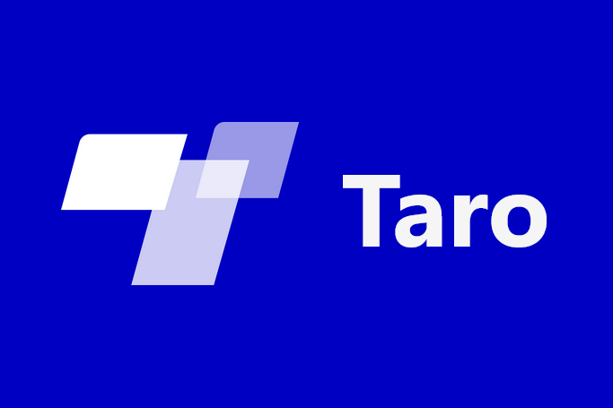
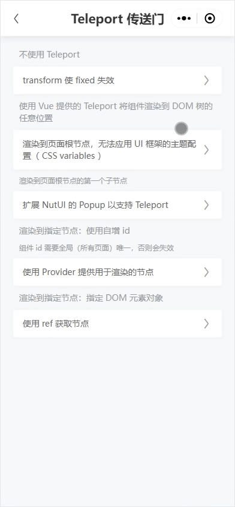

### 背景

---

**传送门** 的作用是将组件渲染到 **DOM** 树的任意位置，从而摆脱当前组件树的层次结构。常用于制作弹窗、弹出层等，通常 **UI 框架** 已经帮我们做了这部分工作（ 比如渲染到 `body` 下 ），所以项目中很少用到。

- [**Teleport**](https://vuejs.org/guide/built-ins/teleport.html)

  > `<Teleport>` 是一个内置组件，它可以将一个组件内部的一部分模板“传送”到该组件的 DOM 结构外层的位置去。

- [**Portal**](https://react.dev/reference/react-dom/createPortal)

  > portal 允许组件将它们的某些子元素渲染到 DOM 中的不同位置。这使得组件的一部分可以“逃脱”它所在的容器。例如组件可以在页面其余部分上方或外部显示模态对话框和提示框。
  >
  > portal 只改变 DOM 节点的所处位置。在其他方面，portal 中的 JSX 将作为实际渲染它的 React 组件的子节点。该子节点可以访问由父节点树提供的 context 对象、事件将仍然从子节点冒泡到父节点树。

等效代码：

```typescript
const node = document.createElement('div');
node.setAttribute('style', 'position: fixed;z-index: 1000;background: rgba(0, 0, 0, 0.45);width: 100vw;height: 100vh;left: 0;top: 0;');
document.body.appendChild(node); // 插入到 body 最后面
document.body.insertBefore(node, document.body.firstChild); // 插入到 body 最前面
```

[**Taro**](https://docs.taro.zone) 在文档中是这么描述的：

- [**不支持 Vue3 `Teleport`**](https://docs.taro.zone/docs/vue3#teleport)

  > 由于不能在页面组件的 DOM 树之外插入元素，因此不支持应用级别的 `<teleport>` 。但你仍可以在当前页面内使用 `<teleport>` 。
  >
  > 示例项目： [taro-vue-teleport](https://github.com/AdvancedCat/taro-vue-teleport)

- [**不支持 React `Portal`**](https://docs.taro.zone/docs/react-overall/#createportal)

  > React `createPortal` 支持将组件渲染至特定的 dom 节点中，由于不能在页面组件的 DOM 树之外插入元素，无法实现应用级别的 `<Portal>` 组件。但你仍可以在当前页面中使用 `createPortal` 。
  >
  > 示例项目： [taro-react-portal](https://github.com/AdvancedCat/taro-react-portal)
  >
  > [问题在于小程序环境要实现跨页面的全局组件，这点还是不好实现，需要再想想](https://github.com/NervJS/taro/issues/11751#issuecomment-1118094486)

跑了文档中的示例项目之后发现 **Teleport / Portal** 的基本功能都是支持的，可以满足将组件渲染到当前页面中的某个节点中。

不明白 **跨页面的全局组件** 的意义是什么（ 难道是浮窗按钮？ ），毕竟一个屏幕下只能同时显示一个页面的内容，将 **A** 页面中某个组件渲染到 **B** 页面中也看不见，意义不大。如果真有这样的需求，我觉得 **页面级全局组件** 再配合 **状态管理工具**（ [Redux](https://redux.js.org) 、 [Pinia](https://pinia.vuejs.org) 等 ）也能实现跨页面后台展示的效果。

### 需要用到 Teleport / Portal 的场景

---

一般我们会使用 [`position: fixed`](https://developer.mozilla.org/docs/Web/CSS/position#fixed) 来实现悬浮在某个位置的效果，不使用 **Teleport / Portal** 也能用，但是组件多了之后 `z-index` 的层级问题就不好控制了。

- [CSS 的 position 和 z-index 有关](https://godbasin.github.io/2016/06/25/about-position)
- [css - Position 定位属性与层级关系](https://www.cnblogs.com/padding1015/p/6727957.html)

> 1. 首先是遵循 **DOM** 的规则，同级的后面居上。
> 2. 一般有定位属性的元素会高于无定位属性的同级元素。
> 3. 都有定位属性的同级元素， `z-index` 大者居上。
> 4. 如果是非同级的元素，则会忽略元素本身 `z-index` ，取与对比元素同级的祖先元素的 `z-index` 属性，大者居上。

层级问题还是其次，更关键的是 `fixed` 在一些场景下会失效降级为 `absolute` ：

> 当元素祖先的 `transform` 、`perspective` 、`filter` 或 `backdrop-filter` 属性非 `none` 时，容器由视口改为该祖先。
>
> - [CSS3 transform 使 position:fixed 元素 absolute 化 » 张鑫旭-鑫空间-鑫生活](https://www.zhangxinxu.com/study/201505/css3-transform-position-fixed-to-absolute.html)
> - [移动端 -webkit-overflow-scrolling 导致 fixed 失效](https://www.jianshu.com/p/9125e7cf1fb0)

**一个列表左滑删除的例子：左滑显示删除按钮，点击删除显示确认删除的弹窗。**

[滑动组件](https://nutui.jd.com/taro/vue/4x/#/zh-CN/component/swipe) 带有 `transform` 样式导致弹窗组件的 `fixed` 失效，为了修复这个问题只能将弹窗组件写在滑动组件外部，这时封装 `ListItem` 组件会非常麻烦，要通过事件向上传递和弹窗组件进行通讯。

项目中这样的场景不在少数，如果组件树中某个中间节点增加了 `transform` 样式就需要重新梳理组件结构了。

**如果能将 `fixed` 组件直接渲染到外部的话，就完全不需要考虑这方面问题了。**

### 整合思路与遇到的问题

---

#### 封装传送门组件

主要是对内置的 **Teleport / Portal** 组件做了一层简单封装，因为 **Taro** 是跨平台框架，各端实现有所差异，所以需要在这一层做兼容处理。

组件提供 `enable` 、 `target` 和 `root` 三个属性，其中 `enable` 用于控制是否从页面中脱离出来，剩下的属性用于控制渲染逻辑：

- 指定了 `target` 且值非空时，渲染到指定的节点上，可以是一个 **DOM** 元素对象或者其 **id** 。

  > [!NOTE]
  >
  > **Vue** 中不能用 **class** 选择器，因为 [`querySelector` 是用 `getElementById` 模拟的](https://github.com/NervJS/taro/commit/2db9bdf289dab4e3c514c1ca151d4d5997a62260#diff-d7ae218b39f54c0aed1ec3bd9d0a3e57347bf7df7583e0e354ba6d9630433acaR36-R43) ，只支持 **id** 。

- 当 `root` 值为 `'first'` 时，渲染到页面根节点的第一个子节点。

- 当 `root` 值为 `true` 时，渲染到页面根节点。

- 当外层用传送门组件的 `Provider` 包裹时，渲染到 `Provider` 中提供的节点上。

- 缺省渲染到页面根节点。

  > [!NOTE]
  >
  > 无法应用 **UI 框架** 中 [`CSS variables`](https://developer.mozilla.org/docs/Web/CSS/--*) 方式的主题配置。

#### 封装 UI 框架的弹窗组件

本文中使用的 **UI 框架** 是 [**NutUI**](https://nutui.jd.com) ，正好 [**Vue**](https://nutui.jd.com/taro/vue/4x/#/zh-CN/guide/intro) 和 [**React**](https://nutui.jd.com/taro/react/2x/#/zh-CN/guide/intro-react) 两个版本都支持。包装一下 `Popup` 组件使其默认就渲染到页面根节点的第一个子节点上，这样使用的时候就会省事很多。

#### 获取用于渲染的节点

- 使用 `ref` 语法来获取节点。

  由于 [不同平台不同框架 ref 获取到的节点类型不同](https://docs.taro.zone/docs/ref#ref-%E8%AF%AD%E6%B3%95) ，这种方式的可靠性还有待验证。

- 使用 [`document.getElementById`](https://developer.mozilla.org/docs/Web/API/Document/getElementById) **DOM API** 来获取节点。

  这种方式的限制就是需要保证组件 **id** 全局（ 所有页面 ）唯一（ [参考](https://github.com/NervJS/taro/issues/7317) ）：

  - **H5 端** 多页应用每个页面是用 `div` 模拟的，如果 **id** 不唯一就会获取到其他页面上的节点，导致失效。

    > 文档中的 ID 必须是唯一的。如果一个文档中有两个及以上的元素具有相同的 ID ，那么该方法只会返回查找到的第一个元素。

  - **小程序端** [`getElementById`](https://github.com/NervJS/taro/blob/v3.6.25/packages/taro-runtime/src/dom/document.ts#L72-L75) 是通过全局的 [`eventSource`](https://github.com/NervJS/taro/blob/v3.6.25/packages/taro-runtime/src/dom/event-source.ts) 实现的。

    组件卸载的时候会调用 [`eventSource.removeNodeTree`](https://github.com/NervJS/taro/blob/v3.6.25/packages/taro-runtime/src/dom/node.ts#L309-L311) 将组件对应的 **id** 从 `eventSource` 中移除（ [参考](https://github.com/NervJS/taro/issues/10720#issuecomment-981112916) ），这就导致一个问题： **如果两个页面中都存在 id 为 `teleportId` 的组件，切换到下一页再后退回来，就会发现当前页面无法通过这个 id 获取到组件了** 。

    **Taro** 文档中提供的示例项目 [taro-vue-teleport](https://github.com/AdvancedCat/taro-vue-teleport/blob/main/src/pages/index/index.vue#L5) 就有这个问题，其中 `teleport` 的 `v-if` 和 `showModal` 绑定了，也就是说每次关闭弹窗再打开弹窗会创建新的 `teleport` 组件，导致每次都会重新调用一遍 [`resolveTarget`](https://github.com/vuejs/core/blob/v3.4.21/packages/runtime-core/src/components/Teleport.ts#L111) ，再结合重复 **id** 的问题就会得到 [下面的错误](https://github.com/vuejs/core/blob/v3.4.21/packages/runtime-core/src/components/Teleport.ts#L53-L56) ：

    ```shell
    [Vue warn]: Failed to locate Teleport target with selector "#teleportId". Note the target element must exist before the component is mounted - i.e. the target cannot be rendered by the component itself, and ideally should be outside of the entire Vue component tree.
    ```

    应该避免 `teleport` 的重复卸载创建，卸载 `teleport` 还可能会导致 **slot** 中的一些事件无法触发。比如下面这个例子中，打开弹窗后点击遮罩没法关闭的，只能点击自定义的关闭按钮才行。

    ```vue
    <template>
      <view id="teleportId">
        <nut-button @click="show = true">open</nut-button>
        <teleport v-if="show" to="#teleportId">
          <nut-popup v-model:visible="show">
            <nut-button @click="show = false">close</nut-button>
          </nut-popup>
        </teleport>
      </view>
    </template>

    <script setup lang="ts">
    import { ref } from 'vue';

    const show = ref(false);
    </script>
    ```

    当然，不绑定 `v-if` 还是会报错：

    ```typescript
    [Vue warn]: Invalid Teleport target on mount: null (object)
    ```

    因为首次渲染完成前无法获取到 **DOM** 元素对象，需要延迟渲染 `teleport` :

    ```vue
    <template>
      <view id="teleportId">
        <nut-button @click="show = true">open</nut-button>
        <teleport v-if="showTeleport" to="#teleportId">
          <nut-popup v-model:visible="show">
            <nut-button @click="show = false">close</nut-button>
          </nut-popup>
        </teleport>
      </view>
    </template>

    <script setup lang="ts">
    import { onMounted, ref } from 'vue';

    const show = ref(false);
    const showTeleport = ref(false);

    onMounted(() => {
      showTeleport.value = true;
    });
    </script>
    ```

  说起保证 **id** 唯一的方法，我看一些项目中用到 [随机数](https://github.com/jdf2e/nutui/blob/v4.3.4/src/packages/__VUE/rate/rate.taro.vue#L87) 来作为 **id** ，但这种方式还是无法完全避免重复，其实 **Taro** 中已经提供 [自增 id](https://github.com/NervJS/taro/blob/v3.6.25/packages/taro-runtime/src/dom/node.ts#L23) 的算法，直接拿来用就好了，具体参考下面代码中的 [`nextTeleportId`](#constants.ts) 。

#### 获取页面根节点

由于 **H5 端** 多页应用每个页面是用 `div` 模拟的，如果直接渲染到 `body` 或者 `#app` （ **小程序中没有的** ）上，不同页面中的组件放在一起，样式效果容易打架。 **每个页面的组件应该只渲染在当前页面所属的 `div` 下面，不要越界。**

**Taro** 内部实现了一层 **Page** 组件作为页面的根节点，我们在项目代码中没法直接对它进行修改。所幸 **Page** 组件都是有 **id** 的，也就是 **当前页面的路由路径** （ [参考](https://github.com/NervJS/taro/issues/7282#issuecomment-1676778571) ），有了 **id** 就能拿到页面根节点并渲染到上面，开箱即用也省得要自己手动埋点了。

不过这个 **id** 直接用到 `teleport` 中是会报错的：

```typescript
Uncaught (in promise) DOMException: Failed to execute 'querySelector' on 'Document': '#/pages/index/index?stamp=AA' is not a valid selector.
```

因为 `teleport` 内部用到了 [`document.querySelector`](https://developer.mozilla.org/zh-CN/docs/Web/API/Document/querySelector) ，而 **H5 端** `querySelector` 的参数不能包含一些特殊字符。然而同样的 **id** 使用 `getElementById` 是不会报错的。

模拟报错效果：

```typescript
const id = '/pages/index/index?stamp=AA';
document.getElementById(id);
document.querySelector(`#${id}`);
```

解决办法：使用 [`CSS.escape`](https://developer.mozilla.org/docs/Web/API/CSS/escape_static) 进行转义（ [参考](https://github.com/facebook/react/issues/28404#issuecomment-1958470536) ）

```typescript
document.querySelector(`#${CSS.escape(id)}`);
```

- [A polyfill for the CSS.escape](https://github.com/mathiasbynens/CSS.escape/blob/master/css.escape.js)

### 在 Vue 中使用 Teleport

---



---

#### biz-teleport.vue

---

```vue
<template>
  <teleport v-if="!enable || show" :disabled :to="computedTarget">
    <slot />
  </teleport>
</template>

<script setup lang="ts">
import type { TaroElement } from '@tarojs/runtime';
import { isString } from '@tarojs/shared';
import { computed, inject, onMounted, ref, toRaw, toValue, type MaybeRef } from 'vue';
import { isWeb, TELEPORT_TARGET_KEY } from './constants';
import { useTaroPageRootElement } from './hooks';

const props = withDefaults(defineProps<Props>(), {
  enable: true,
  target: undefined,
  root: undefined,
});

/**
 * https://vuejs.org/guide/built-ins/teleport.html
 */
interface Props {
  /**
   * 是否从页面中脱离出来
   */
  enable?: boolean;
  /**
   * 传送的目标：可以是一个 DOM 元素对象或者其 id
   *
   * teleport 中用 class 选择器在小程序中会报错，因为 `querySelector` 是用 `getElementById` 模拟的
   *
   * ref: https://github.com/NervJS/taro/commit/2db9bdf289dab4e3c514c1ca151d4d5997a62260#diff-d7ae218b39f54c0aed1ec3bd9d0a3e57347bf7df7583e0e354ba6d9630433acaR36-R43
   *
   * 组件 id 需要全局（所有页面）唯一，否则会失效
   *
   * ref: https://github.com/NervJS/taro/issues/7317#issuecomment-722169193
   */
  target?: string | TaroElement | null;
  /**
   * 优先级小于 `target`
   *
   * `true`     - 渲染到页面根节点
   * `'first'`  - 渲染到页面根节点的第一个子节点，用于适配 `ConfigProvider` 全局配置
   */
  root?: boolean | 'first';
}

const show = ref(false);

onMounted(() => {
  // 卸载 teleport 会导致 slot 中的一些事件无法触发
  // 首次渲染完成前无法获取 dom 所以需要延迟显示 teleport ref: https://docs.taro.zone/docs/ref
  show.value = true;
});

const pageNode = useTaroPageRootElement();

const provideTarget = inject<MaybeRef<TaroElement> | null>(TELEPORT_TARGET_KEY, null);

function parseTarget(to?: MaybeRef<TaroElement> | string) {
  if (!isString(to)) {
    // 不同平台 ref 获取到的节点类型不同 ref: https://docs.taro.zone/docs/ref#ref-%E8%AF%AD%E6%B3%95
    return toRaw(toValue(to));
  }
  // use `CSS.escape` to escape the selector
  // ref: https://github.com/bootstrap-vue/bootstrap-vue/issues/5561
  // ref: https://github.com/facebook/react/issues/28404#issuecomment-1958470536
  return to ? `#${isWeb ? CSS.escape(to) : to}` : undefined;
}

const computedTarget = computed(() => {
  const { target, root } = props;

  return parseTarget(
    target ||
      (root
        ? root === 'first'
          ? pageNode.value?.firstChild
          : pageNode
        : provideTarget ?? pageNode),
  );
});

const disabled = computed(() => !(props.enable && computedTarget.value));
</script>
```

---

#### constants.ts

---

```typescript
import { incrementId } from '@tarojs/runtime';

export const TELEPORT_TARGET_KEY = Symbol('teleport-target');

export const nodeId = incrementId();

export const nextTeleportId = () => `teleport-${nodeId()}`;

export const isWeb = process.env.TARO_ENV === 'h5';
```

---

#### hooks.ts

---

```typescript
import type { TaroRootElement } from '@tarojs/runtime';
import type { Router } from '@tarojs/runtime/dist/current';
import { nextTick, useRouter } from '@tarojs/taro';
import { inject, ref } from 'vue';

/**
 * 注入页面根节点 id
 *
 * ref: https://github.com/NervJS/taro/blob/v3.6.25/packages/taro-plugin-vue3/src/runtime/connect.ts#L88
 */
export function injectTaroPageId() {
  return inject('id') as string;
}

/**
 * 获取页面根节点 id
 *
 * ref: https://github.com/NervJS/taro/blob/v3.6.25/packages/taro-runtime/src/next-tick.ts#L21
 */
export function useTaroPageId() {
  const router = useRouter();
  return (router as unknown as Router).$taroPath;
}

/**
 * 获取页面根节点
 */
export function useTaroPageRootElement() {
  const pageId = useTaroPageId();
  const dom = ref<TaroRootElement | null>();

  nextTick(() => {
    dom.value = document.getElementById(pageId) as TaroRootElement | null;
  });

  return dom;
}
```

> [!NOTE]
>
> 其中 `injectTaroPageId` 目前还用不上，如果项目中只是为了获取页面组件的 **id** ，用这个注入的方式更好。
>
> - [**Taro** 在页面组件中将其 **id** 提供出来了](https://github.com/NervJS/taro/blob/v3.6.25/packages/taro-plugin-vue3/src/runtime/connect.ts#L88)

---

#### biz-popup.vue

---

```vue
<template>
  <biz-teleport :root :target="teleport">
    <nut-popup v-bind="$attrs">
      <slot />
    </nut-popup>
  </biz-teleport>
</template>

<script setup lang="ts">
import type { TaroElement } from '@tarojs/runtime';
import type { ExtractPropTypes } from 'vue';
import { popupProps } from '@nutui/nutui-taro/dist/types/__VUE/popup/props';
import BizTeleport from './biz-teleport';

defineOptions({ inheritAttrs: false });

withDefaults(defineProps<Props>(), {
  teleport: undefined,
  root: 'first',
});

type PopupProps = Partial<ExtractPropTypes<typeof popupProps>>;

/**
 * 只需要类型提示，加 `@vue-ignore` 可以避免运行时注册为属性，直接透传
 */
interface Props extends /* @vue-ignore */ PopupProps {
  /**
   * 传送的目标：可以是一个 DOM 元素对象或者其 id
   */
  teleport?: string | TaroElement | null;
  /**
   * 优先级小于 `target`
   *
   * `true`     - 渲染到页面根节点
   * `'first'`  - 渲染到页面根节点的第一个子节点，用于适配 `ConfigProvider` 全局配置
   */
  root?: boolean | 'first';
}
</script>
```

#### 用法示例

---

- **index.vue**

---

```vue
<template>
  <nut-config-provider :theme-vars>
    <demo v-slot="{ show }" title="不使用 Teleport">
      <nut-popup v-model:visible="show.value">
        <content>初始</content>
      </nut-popup>
    </demo>

    <demo v-slot="{ show }" title="渲染到页面根节点">
      <biz-teleport>
        <nut-popup v-model:visible="show.value">
          <content>页面根节点</content>
        </nut-popup>
      </biz-teleport>
    </demo>

    <demo v-slot="{ show }" title="渲染到页面根节点的第一个子节点">
      <biz-popup v-model:visible="show.value">
        <content>第一子节点</content>
      </biz-popup>
    </demo>
  </nut-config-provider>
</template>

<script setup lang="tsx">
import { View } from '@tarojs/components';
import Taro, { useRouter } from '@tarojs/taro';
import { defineComponent, ref, type SetupContext } from 'vue';
import BizPopup from './biz-popup';
import BizTeleport from './biz-teleport';

const Demo = defineComponent(
  ({ title }, { slots }: SetupContext) => {
    const show = ref(false);
    return () => (
      <View class="transform-container">
        <nut-cell is-link title={title} onClick={() => (show.value = true)} />
        {slots.default({ show })}
      </View>
    );
  },
  {
    props: ['title'],
  },
);

const Content = (_, { slots }: SetupContext) => (
  <nut-button type="primary" onClick={navigate} style={{ margin: '30px' }}>
    {slots.default()}
  </nut-button>
);

const themeVars = ref({
  primaryColor: '#a681fd',
});

const router = useRouter();

async function navigate() {
  await Taro.navigateTo({ url: router.path.split('?')[0] });
}
</script>

<style lang="scss">
.transform-container {
  transform: scale(1);
}

.nut-popup {
  max-height: unset;
}
</style>
```

> 其中 `:theme-vars` 是 `Vue@3.4` 新增的 [同名简写](https://vuejs.org/guide/essentials/template-syntax.html#same-name-shorthand) 语法。

对比了使用 `Teleport` 前后的效果，使用 `biz-popup` 更简单。

默认渲染到页面根节点（ 或者其第一个子节点 ），要实现渲染到自定义节点需要进一步改造。

---

#### biz-teleport-provider.vue

---

```vue
<template>
  <slot />
  <view :id="teleportId" />
</template>

<script setup lang="ts">
import { provide } from 'vue';
import { nextTeleportId, TELEPORT_TARGET_KEY } from './constants';

defineOptions({ inheritAttrs: false });

const teleportId = nextTeleportId();

provide(TELEPORT_TARGET_KEY, teleportId);
</script>
```

提供一个用于渲染的节点，并将其 **id** 通过 [依赖注入](https://vuejs.org/api/composition-api-dependency-injection.html#composition-api-dependency-injection) 的方式传递给子组件。这样在子组件中使用 `biz-teleport` 就能自动渲染到这个节点上。

---

- 用法

---

```vue
<template>
  <biz-teleport-provider>
    <demo v-slot="{ show }" title="使用 Provider">
      <biz-teleport>
        <nut-popup v-model:visible="show.value">
          <content>Provider</content>
        </nut-popup>
      </biz-teleport>
    </demo>
  </biz-teleport-provider>
</template>

<script setup lang="tsx">
// ...
import BizTeleportProvider from './biz-teleport-provider';
</script>
```

当前也可以使用 `ref` 获取节点，然后传递给 `biz-teleport` ：

```vue
<template>
  <demo v-slot="{ show }" title="使用 ref">
    <biz-teleport :target="targetRef">
      <nut-popup v-model:visible="show.value">
        <content>Ref</content>
      </nut-popup>
    </biz-teleport>
  </demo>
  <div v-if="isWeb" ref="targetRef" class="teleport-target" />
  <view v-else ref="targetRef" class="teleport-target" />
</template>

<script setup lang="tsx">
// ...
import { isWeb } from './constants';

const targetRef = ref();
</script>
```

**注意使用 `ref` 的方式，在 H5 端需要使用 `div` 而不能用 Taro 内置的 `view` ，否则会报错：**

```typescript
Uncaught (in promise) TypeError: parent.insertBefore is not a function
```

> 在 **React** 中没这个问题。

---

#### 完整代码

👉 **commit [anyesu/taro-demo@`f4511d4`](https://github.com/anyesu/taro-demo/commit/f4511d4ca2a5ca3136da2d6deaaa360be3c48138)**

---

### 在 React 中使用 Portal

---

~~其中 `createPortal` 是从 [`@tarojs/react`](https://github.com/NervJS/taro/blob/v3.6.25/packages/taro-react/src/index.ts#L59) 包导入的，对比 [`react-dom` ](https://github.com/facebook/react/blob/v18.0.0/packages/react-reconciler/src/ReactPortal.js#L27) 中的实现，主要的区别是少了 [校验](https://github.com/facebook/react/blob/v18.0.0/packages/react-dom/src/client/ReactDOM.js#L110-L112) 并对 [`Symbol.for`](https://developer.mozilla.org/docs/Web/JavaScript/Reference/Global_Objects/Symbol/for) 做了兼容处理。~~

[`@tarojs/react` 是小程序专用的](https://github.com/NervJS/taro/blob/v3.6.25/packages/taro-react/README.md?plain=1#L3) ，由于 [过于精简](https://docs.taro.zone/docs/use-h5#%E4%B8%8D%E6%94%AF%E6%8C%81-reactdom-%E9%83%A8%E5%88%86-api) ，用在 **H5 端** 反而会引起一些错误。并且 `@tarojs/plugin-framework-react` 插件针对 **小程序端** 专门做了一层 [`alias`](https://github.com/NervJS/taro/blob/v3.6.25/packages/taro-plugin-react/src/webpack.mini.ts#L9-L20) ，将 `react-dom` 导入映射为 `@tarojs/react` ，所以在项目中直接统一使用 `react-dom` 就好了。

> 微信小程序也提供了 [`root-portal`](https://developers.weixin.qq.com/miniprogram/dev/component/root-portal.html) 组件，原生支持了 `Portal` 的能力。 👉 [Taro 文档](https://docs.taro.zone/docs/components/viewContainer/root-portal)


---

#### biz-portal.tsx

---

> 和 **Vue** 中的实现比做了一点简化，其中 `target` 属性不支持传 **id** 字符串，因为加了之后逻辑会复杂很多。可以在外部根据 **id** 获取到对应的 `DOM 元素对象` 后再传入，具体参考下文的用法示例。
>
> `Provider` 中 `ref` 的值要用 `useState` 存而不能用 `useRef` 。（ [参考](https://stackoverflow.com/a/67906087) ）
>
> - [How can I measure a DOM node?](https://reactjs.org/docs/hooks-faq.html#how-can-i-measure-a-dom-node)

```tsx
import { View } from '@tarojs/components';
import type { TaroElement } from '@tarojs/runtime';
import { createContext, useCallback, useContext, useState, type PropsWithChildren } from 'react';
import { createPortal } from 'react-dom';
import { useTaroPage } from './hooks';

export type BizPortalTarget = TaroElement | null | undefined;

export interface BizPortalProps extends PropsWithChildren {
  /**
   * 是否从页面中脱离出来
   */
  enable?: boolean;
  /**
   * 传送的目标：DOM 元素对象
   */
  target?: BizPortalTarget;
  /**
   * 优先级小于 `target`
   *
   * `true`     - 渲染到页面根节点
   * `'first'`  - 渲染到页面根节点的第一个子节点，用于适配 `ConfigProvider` 全局配置
   */
  root?: boolean | 'first';
}

const BizPortalRefContext = createContext<BizPortalTarget>(null);

export const useBizPortalRef = () => useContext(BizPortalRefContext);

export function BizPortalProvider({ children }: PropsWithChildren) {
  // ref: https://stackoverflow.com/a/67906087
  const [dom, setDom] = useState<BizPortalTarget>();
  const ref = useCallback((node: BizPortalTarget) => node && setDom(node), []);

  return (
    <BizPortalRefContext.Provider value={dom}>
      {children}
      <View ref={ref} className="teleport-target" />
    </BizPortalRefContext.Provider>
  );
}

/**
 * ref: https://react.dev/reference/react-dom/createPortal
 * ref: https://docs.taro.zone/docs/components/viewContainer/root-portal
 * ref: https://github.com/NervJS/taro/issues/7282#issuecomment-1676778571
 */
export default function BizPortal(props: BizPortalProps) {
  const { children, enable = true, target, root } = props;
  const provideTarget = useBizPortalRef();
  const pageNode = useTaroPage();

  const targetNode =
    target ||
    (root ? (root === 'first' ? pageNode?.firstChild : pageNode) : provideTarget ?? pageNode);
  return enable && targetNode ? createPortal(children, targetNode as any) : children;
}
```

---

#### hooks.ts

---

> 参照这个 [例子](https://github.com/NervJS/taro/issues/7282#issuecomment-1676778571) 拆分成了三个 **hook** ，方便灵活使用。

```typescript
import type { TaroElement } from '@tarojs/runtime';
import type { Router } from '@tarojs/runtime/dist/current';
import { useRouter } from '@tarojs/taro';
import { useLayoutEffect, useState } from 'react';

/**
 * 获取页面根节点 id
 *
 * ref: https://github.com/NervJS/taro/blob/v3.6.25/packages/taro-runtime/src/next-tick.ts#L21
 */
export function useTaroPageId() {
  const router = useRouter();
  return (router as unknown as Router).$taroPath;
}

/**
 * 根据 id 获取 DOM 元素对象
 */
export function useTaroElement(id?: string) {
  const [dom, setDom] = useState<TaroElement | null>(null);

  useLayoutEffect(() => {
    if (!id) return;
    const node = document.getElementById(id) as TaroElement | null;
    setDom(node);
  }, [id]);

  return dom;
}

/**
 * 获取页面根节点
 *
 * ref: https://github.com/NervJS/taro/issues/7282#issuecomment-1676778571
 */
export function useTaroPage() {
  const pageId = useTaroPageId();
  return useTaroElement(pageId);
}
```

---

#### biz-popup.tsx

---

> **NutUI-React** 的 [`Popup`](https://nutui.jd.com/taro/react/2x/#/zh-CN/component/popup) 组件已经有 [`portal`](https://github.com/jdf2e/nutui-react/blob/v2.6.0/src/packages/popup/popup.taro.tsx#L200) 属性了，也可以直接用。

```tsx
import type { TaroElement } from '@tarojs/runtime';
import { Popup, type PopupProps } from '@nutui/nutui-react-taro';
import BizPortal from './biz-portal';

export interface BizPopupProps extends Partial<PopupProps> {
  /**
   * 传送的目标：DOM 元素对象
   *
   * 不覆盖 `PopupProps['portal']`
   */
  teleport?: TaroElement | null;
  /**
   * 优先级小于 `target`
   *
   * `true`     - 渲染到页面根节点
   * `'first'`  - 渲染到页面根节点的第一个子节点，用于适配 `ConfigProvider` 全局配置
   */
  root?: boolean | 'first';
}

export default function BizPopup({ root = 'first', teleport, ...rest }: BizPopupProps) {
  return (
    <BizPortal root={root} target={teleport}>
      <Popup {...rest} />
    </BizPortal>
  );
}
```

#### 用法示例

---

- **index.tsx**

---

```tsx
import { View } from '@tarojs/components';
import { incrementId } from '@tarojs/runtime';
import Taro, { useRouter } from '@tarojs/taro';
import { useRef, useState, type PropsWithChildren, type ReactNode } from 'react';
import { ArrowRight } from '@nutui/icons-react-taro';
import { Button, Cell, ConfigProvider, Popup } from '@nutui/nutui-react-taro';
import BizPopup from './biz-popup';
import BizPortal, { BizPortalProvider } from './biz-portal';
import { useTaroElement } from './hooks';
import './index.scss';

interface SlotProps {
  show: boolean;
  setShow: (show: boolean) => void;
}

interface DemoProps {
  title?: ReactNode;
  children?: (slotProps: SlotProps) => ReactNode;
}

const nodeId = incrementId(); // 自增 id
const nextTeleportId = () => `teleport-${nodeId()}`;

function Demo({ children, title }: DemoProps) {
  const [show, setShow] = useState(false);
  return (
    <View className="transform-container">
      <Cell title={title} extra={<ArrowRight />} onClick={() => setShow(true)} />
      {children?.({ show, setShow })}
    </View>
  );
}

function Content({ children }: PropsWithChildren) {
  const router = useRouter();
  async function navigate() {
    await Taro.navigateTo({ url: router.path.split('?')[0] });
  }
  return (
    <Button type="primary" onClick={navigate} style={{ margin: '30px' }}>
      {children}
    </Button>
  );
}

const primaryColor = '#a681fd';

const theme = {
  nutuiColorPrimary: primaryColor,
  nutuiColorPrimaryStop1: primaryColor,
  nutuiColorPrimaryStop2: primaryColor,
};

export default function Page() {
  const targetId = useRef(nextTeleportId());
  const targetRef = useTaroElement(targetId.current);

  return (
    <ConfigProvider theme={theme}>
      <Demo title="不使用 Portal">
        {({ show, setShow }) => (
          <Popup visible={show} onClose={() => setShow(false)}>
            <Content>初始</Content>
          </Popup>
        )}
      </Demo>

      <Demo title="渲染到页面根节点">
        {({ show, setShow }) => (
          <BizPortal>
            <Popup visible={show} onClose={() => setShow(false)}>
              <Content>页面根节点</Content>
            </Popup>
          </BizPortal>
        )}
      </Demo>

      <Demo title="渲染到页面根节点的第一个子节点">
        {({ show, setShow }) => (
          <BizPopup visible={show} onClose={() => setShow(false)}>
            <Content>第一子节点</Content>
          </BizPopup>
        )}
      </Demo>

      <BizPortalProvider>
        <Demo title="使用 Provider">
          {({ show, setShow }) => (
            <BizPortal>
              <Popup visible={show} onClose={() => setShow(false)}>
                <Content>Provider</Content>
              </Popup>
            </BizPortal>
          )}
        </Demo>
      </BizPortalProvider>

      <Demo title="使用 id">
        {({ show, setShow }) => (
          <BizPortal target={targetRef}>
            <Popup visible={show} onClose={() => setShow(false)}>
              <Content>targetId</Content>
            </Popup>
          </BizPortal>
        )}
      </Demo>
      <View id={targetId.current} />
    </ConfigProvider>
  );
}
```

---

- **index.scss**

---

```css
.transform-container {
  transform: scale(1);
}

.nut-popup {
  max-height: unset;
}
```

---

#### 完整代码

👉 **commit [anyesu/taro-demo@`47e4ce8`](https://github.com/anyesu/taro-demo/commit/47e4ce8189b7b2eb8f868070c9cde4d93a1dfdb7)** （ [修正](https://github.com/anyesu/taro-demo/commit/5fbf80e68e6846346f273b8b17825674f73076bb) ）

---

### 其他相关问题

---

#### 在 Vue [单文件组件（ SFC ）](https://vuejs.org/guide/scaling-up/sfc.html) 中使用 [JSX](https://vuejs.org/guide/extras/render-function.html)

对应 **Vue** 版本的用法示例中的 `Demo` 组件。

只是单纯不想多创建文件，写法上繁琐很多，也缺少语法提示，平时不建议用。

需要将 [`<script>`](https://vuejs.org/api/sfc-script-setup.html#script-setup) 标签上的 [`lang`](https://vuejs.org/api/sfc-spec.html#pre-processors) 属性设置为 `jsx` 或者 `tsx` （ [否则 prettier 会报错](https://github.com/prettier/prettier/pull/3763) ）：

```vue
<script setup lang="tsx">
</script>
```

除了 [Taro 内置组件](https://docs.taro.zone/docs/components-desc) （ 比如 `View` ）需要 **手动导入** 外其他组件可以 [**自动按需引入**](https://github.com/unplugin/unplugin-vue-components) ，然后将事件绑定改为 **onCamelcase** 格式的属性写法，其他的组件名和属性名都可以写成 [**kebab-case**](https://docs.taro.zone/docs/vue-overall#taro-%E8%A7%84%E8%8C%83) 格式的。

- [为函数式组件标注类型](https://vuejs.org/guide/extras/render-function.html#typing-functional-components)
- [函数签名](https://vuejs.org/api/general.html#function-signature) （ `Vue@3.3+` ）
- [在 Taro 中使用 JSX 编写 Vue3 组件](https://docs.taro.zone/docs/vue3#jsx)

#### 在 Vue 中扩展已有的组件

对应 **Vue** 版本的 [`biz-popup`](#biz-popup.vue) 组件。

其属性通过继承 `nut-popup` 的属性得到完整的类型提示，然后通过 `/* @vue-ignore */` 注释避免了 `biz-popup` 的 [运行时声明](https://vuejs.org/api/sfc-script-setup.html#type-only-props-emit-declarations) 包含属于 `nut-popup` 的属性，这样就可以直接 [透传](https://vuejs.org/guide/components/attrs.html#fallthrough-attributes) 给 `nut-popup` 而无需做额外处理。

#### 在 React 中使用 Vue 中的 [作用域插槽](https://vuejs.org/guide/components/slots.html#scoped-slots) 用法

对应 **React** 版本的用法示例中的 `Demo` 组件。（ [参考](https://stackoverflow.com/a/73416994) ）

#### React Hooks 的执行顺序

一直以来只是拿 `useEffect` 来模拟 [class 组件的生命周期](https://zh-hans.reactjs.org/docs/react-component.html) （ [生命周期图谱](https://projects.wojtekmaj.pl/react-lifecycle-methods-diagram) ），没怎么了解过其他 **Hook** 的执行顺序，跑个 **demo** 测试下：

```tsx
import { useCallback, useEffect, useLayoutEffect, useState } from 'react';

function useHooksTest(name: string) {
  console.log(`${name}: render`);

  const [init, setInit] = useState(false);
  const ref = useCallback(() => console.log(`${name}: ref`), [name]);

  useEffect(() => {
    setInit(true);
  }, []);

  useEffect(() => {
    console.log(`${name}: useEffect`);
    return () => {
      console.log(`${name}: useEffect cleanup`);
    };
  });

  useLayoutEffect(() => {
    console.log(`${name}: useLayoutEffect`);
    return () => {
      console.log(`${name}: useLayoutEffect cleanup`);
    };
  });

  return [ref, init] as const;
}

function Child() {
  const [ref, init] = useHooksTest('子组件');
  return init && <div ref={ref} />;
}

function Parent() {
  const [ref, init] = useHooksTest('父组件');
  return (
    <>
      <Child />
      {init && <div ref={ref} />}
    </>
  );
}

export default function Page() {
  return <Parent />;
}
```

运行结果：

```typescript
父组件: render
子组件: render
// 在此之前纯净且不包含副作用，之后可以使用 DOM，运行副作用，安排更新
子组件: useLayoutEffect
父组件: useLayoutEffect
子组件: useEffect
父组件: useEffect
父组件: render
子组件: render
子组件: useLayoutEffect cleanup
父组件: useLayoutEffect cleanup
子组件: ref
子组件: useLayoutEffect
父组件: ref
父组件: useLayoutEffect
子组件: useEffect cleanup
父组件: useEffect cleanup
子组件: useEffect
父组件: useEffect
```

#### 微信开发者工具中 `fixed` 失效时页面闪烁的问题

[微信开发者工具](https://developers.weixin.qq.com/miniprogram/dev/devtools/stable.html) 升级到目前最新的 `1.06.2402040` 版本还是有问题。 **真机测试没问题。**

**复现步骤：**

- 打开一个 `fixed` 失效的弹窗
- 打开一个正常的弹窗并关闭
- 不断切换第一个失效的弹窗，可以发现界面在不断闪烁，闪烁的画面甚至可以看到上一个页面的内容（ 页面穿透了 ）。

**解决办法：**

初步排查是祖先元素同时设置了 `overflow: hidden` 和 `border-radius` 导致的，把 `hidden` 取消掉或者 `border-radius` 设置为 `0` 都能解决这个闪烁问题，猜测是 `fixed` 降级为 `absolute` 时圆角裁剪有问题。

**演示效果：**


### 源码

---

完整项目代码 👉 [anyesu/taro-demo](https://github.com/anyesu/taro-demo)

- 获取源代码

  ```shell
  $ git clone https://github.com/anyesu/taro-demo
  $ cd taro-demo
  ```

- 安装依赖

  ```shell
  $ pnpm i
  ```

- 运行项目

  ```shell
  # cd packages/taro-demo-react
  $ cd packages/taro-demo-vue3

  $ pnpm dev:h5
  ```

- 浏览器访问： [http://127.0.0.1:10086](http://127.0.0.1:10086)

### 结语

---

最初只是想写个 **demo** 简单记录下，结果拔出萝卜带出泥，越是深入了解坑踩得越多，不过也收获了很多，也是应证了学无止境那句话。

---

#### 转载请注明出处： [https://github.com/anyesu/blog/issues/51](https://anyesu.github.io/blog/articles/51)
