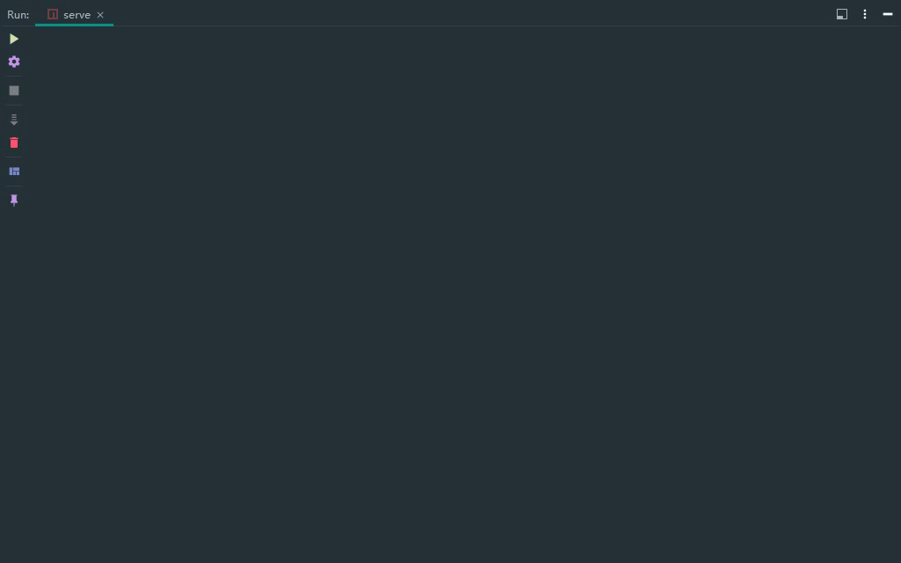
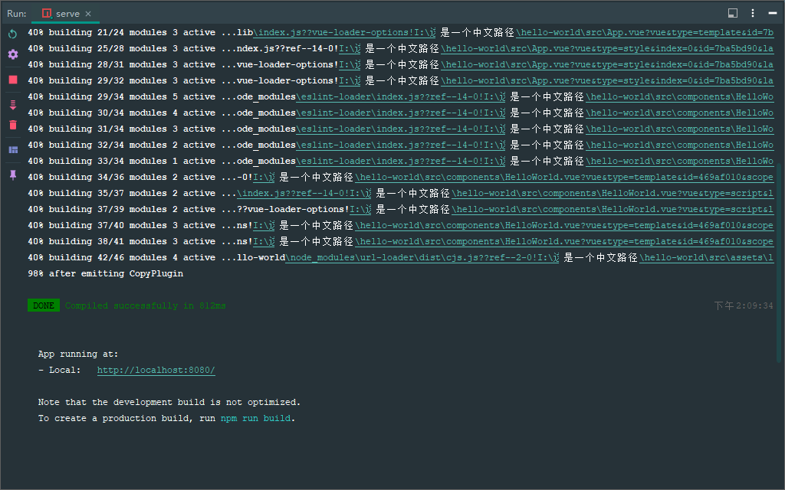
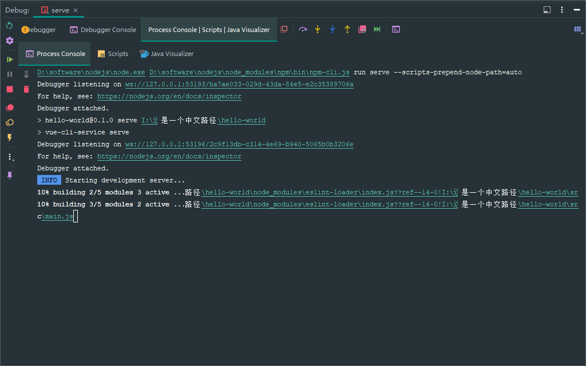
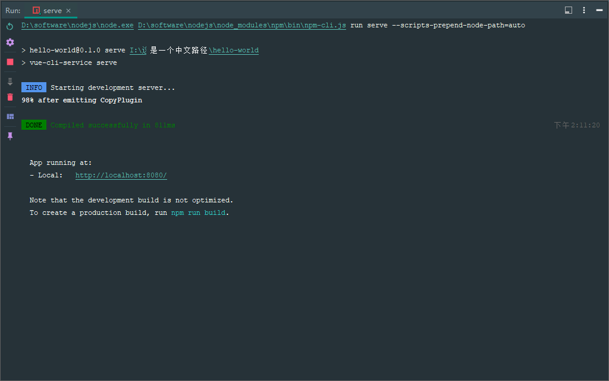
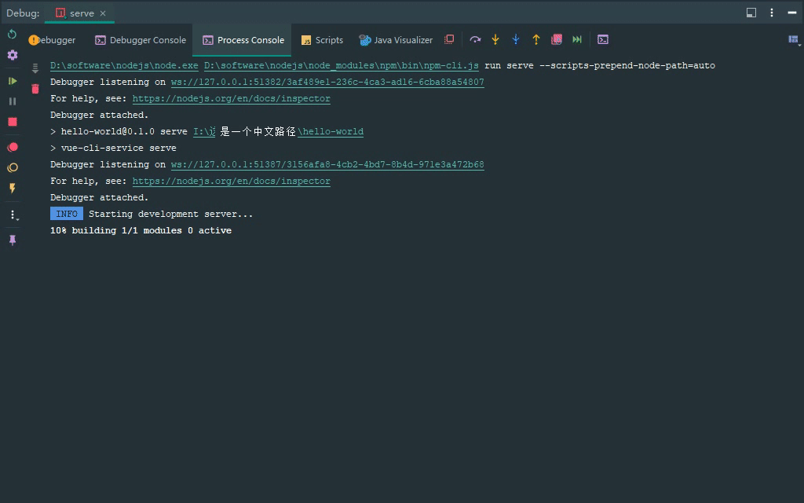
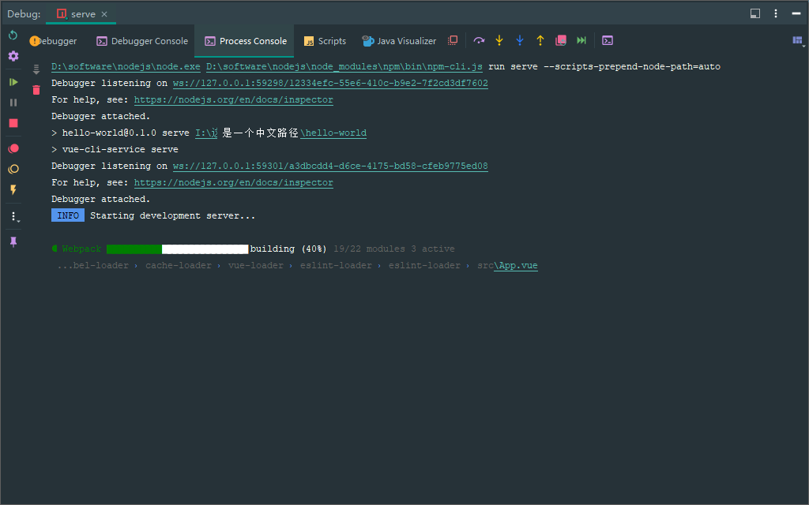
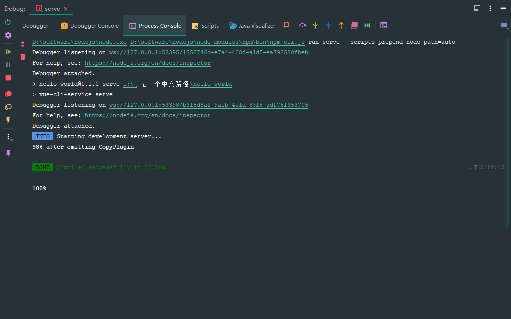
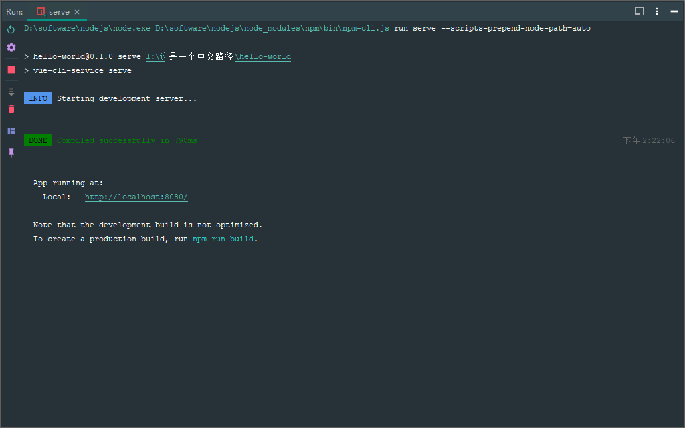

### 背景

---

去年接手的一个用 [vue-element-admin](https://github.com/PanJiaChen/vue-element-admin) 搭建的项目，启动时的进度条日志一直都是像写日志文件一样逐行打印的，而不是预期的动态刷新（ 如下图所示 ）。之前一直忙于项目开发加上这个问题也不影响项目运行就一直没有去管，最近正好空了再加上强迫症犯了，决定研究一下这个问题怎么解决。



### 问题复现

---

首先日志内容包含了中文，猜测和中文路径有关系，把项目拷贝到英文路径下运行，果然就没问题了。

既然如此那就在中文路径下新建一个 **Vue 2** 项目试一下：

```powershell
I:\这是一个中文路径>vue create hello-world
I:\这是一个中文路径>cd hello-world
I:\这是一个中文路径\hello-world>npm run serve
```

果然成功复现了这个问题：



### 问题解决

---

既然知道了是中文路径问题，那就去源码中看下打印的逻辑是怎么样的。根据关键词 [after emitting](https://github.com/webpack/webpack/blob/444e59f8a427f94f0064cae6765e5a3c4b78596d/lib/ProgressPlugin.js#L280) 定位到了 [Webpack](https://github.com/webpack/webpack) 内置的 [ProgressPlugin](https://webpack.js.org/plugins/progress-plugin) 插件，再通过层层 **debug** 找到了实际打印的代码在 [nodeConsole.js](https://github.com/webpack/webpack/blob/444e59f8a427f94f0064cae6765e5a3c4b78596d/lib/node/nodeConsole.js#L48) 这个文件中：

```javascript
const writeStatusMessage = () => {
  if (!currentStatusMessage) return;
  // 获取终端窗口的字符宽度
  const l = process.stderr.columns;
  // 如果打印内容超过终端字符宽度就进行截断，保证只显示一行
  const args = l ? truncateArgs(currentStatusMessage, l - 1) : currentStatusMessage;
  const str = args.join(" ");
  // 设置文字颜色
  const coloredStr = `\u001b[1m${str}\u001b[39m\u001b[22m`;
  // \x1b[2K 表示清除当前行， \r 表示光标移到行首
  process.stderr.write(`\x1b[2K\r${coloredStr}`);
  hasStatusMessage = true;
};
```

我给代码加上了注释，粗看这个逻辑貌似没什么问题：每次只打印一行内容（ 不换行 ），下一次先清空当前行中上一次打印的内容再继续打印一行，这样就实现了在一行中动态刷新的动画效果。

但实际效果是中文字符的显示宽度比英文字符要宽，如果包含了中文字符就会导致显示内容超出一行而自动换行，所以每次清空的是多出来的第二行，而第一行内容则被保留了下来，就形成了逐行打印的效果。



既然是显示内容超出一行了，那多截断一部分内容不就好了，在 [vue.config.js](https://cli.vuejs.org/zh/config/#vue-config-js) 文件中加入下面的代码：

```javascript
module.exports = {
  chainWebpack(config) {
    config.plugin("ProgressPlugin").use(
      new (require("webpack").ProgressPlugin)(() => {
        // 行宽自行调整
        process.stderr.columns = 120;
      })
    );
  },
};
```

原理是通过在 [@vue/cli-service](https://www.npmjs.com/package/@vue/cli-service) 之前另外添加一个 **ProgressPlugin** ，这个插件不打印内容只是起到辅助修改 `process.stderr.columns` 的作用，等同于对 **ProgressPlugin** 做了一次 **hook** 。



再次运行就正常了，不过这个方法有点暴力直接固定死了，值设大了窗口小了还是会有问题，值设小了进度条又看不到有效信息。

还可以再改进一下让它自动适配不同大小的窗口，假设 [一个中文字符的显示宽度是英文字符的两倍](https://www.cnblogs.com/kevinzhwl/archive/2010/06/30/3878916.html) ，再考虑最坏情况截断只删除了英文字符，此时要保证不换行需要满足下面的条件：

```
中文字符数 * 2 + 英文字符数 <= 终端行宽（一行最多可显示英文字符数）
             ⬇
中文字符数 * 2 + (总字数 - 中文字符数) <= 终端行宽
             ⬇
总字数 <= 终端行宽 - 中文字符数
```

考虑到不同字体的显示差异再保守一点：

```
总字数 <= 终端行宽 - 中文字符数 * 2
```

最终代码就是：

```javascript
module.exports = {
  chainWebpack(config) {
    config.plugin("ProgressPlugin").use(
      new (require("webpack").ProgressPlugin)((percentage, message, ...args) => {
        // 获取窗口最新大小
        process.stderr._refreshSize();
        const columns = process.stderr.columns;

        // 计算非 ASCII 可显示字符的数量
        // ref: https://stackoverflow.com/a/14608823
        const regExp = /[^ -~]/g;
        const content = args.join();
        if (regExp.test(content)) {
          const count = content.match(regExp).length;
          process.stderr.columns = Math.max(columns - count * 2, 10);
        }
      })
    );
  },
};
```

注意：这里每次调用 [\_refreshSize()](https://github.com/nodejs/node/blob/d150316a8ecad1a9c20615ae62fcaf4f8d060dcc/lib/tty.js#L126-L141) 是因为 `process.stderr.columns` 的值已经 [被我们修改](https://github.com/nodejs/node/issues/17529#issuecomment-350066759) 了，下一次循环需要重新获取真正的窗口行宽进行计算。而且这个方法并不怎么耗时，项目启动速度也没有明显变慢。

当然，也可以 [监听终端窗口变化](https://nodejs.org/api/process.html#signal-events) 手动同步这个值（ 响应窗口变化时延迟会高一点 ）：

```javascript
let columns = process.stderr.columns;

process.on("SIGWINCH", () => {
  columns = process.stderr.columns;
});

// 也可以用下面的方式监听

// https://nodejs.org/api/tty.html#event-resize
process.stderr.on("resize", () => {
  columns = process.stderr.columns;
});
```

### ANSI escape code

---

上面的方式虽然已经解决问题了，但手动修改 `process.stderr.columns` 的值多少还是会产生其他未知的影响，还得想想更好的方法。

我们平时开发都会用 `console.log()` 去打印一些日志，但内容都是追加上去的不可撤销的，而这个进度条却可以在一行中显示不同的内容，这里用到的黑魔法就是源码中诸如 `\u001b[1m` 、 `\x1b[2K` 之类的特殊字符。这些特殊字符叫做 [ANSI 转义序列](https://zh.wikipedia.org/wiki/ANSI%E8%BD%AC%E4%B9%89%E5%BA%8F%E5%88%97) （ [ANSI escape code](https://en.wikipedia.org/wiki/ANSI_escape_code) ），主要是用到其中的 [CSI 序列](https://zh.wikipedia.org/wiki/ANSI%E8%BD%AC%E4%B9%89%E5%BA%8F%E5%88%97#CSI%E5%BA%8F%E5%88%97) 来控制光标和文字颜色。

> **ANSI 转义序列（ ANSI escape sequences ）** 是一种带内信号的转义序列标准，用于控制视频文本 [终端](https://zh.wikipedia.org/wiki/終端) 上的光标位置、颜色和其他选项。在文本中嵌入确定的字节序列，大部分以 `ESC` [转义字符](https://zh.wikipedia.org/wiki/转义字符) 和 `[` 字符开始，终端会把这些字节序列解释为相应的指令，而不是普通的 [字符编码](https://zh.wikipedia.org/wiki/字符编码) 。
>
> 序列具有不同的长度。所有序列都以 ASCII 字符 `ESC` （ 27 / 十六进制 0x1B ）开头，第二个字节则是 0x40–0x5F （ ASCII `@A–Z[\]^_` ）范围内的字符。
>
> CSI 序列由 `ESC [` 、若干个（ 包括 0 个 ）“参数字节”、若干个“中间字节”，以及一个“最终字节”组成。各部分的字符范围如下：
>
> **CSI 序列在** `ESC [` **之后各个组成部分的字符范围**
>
> | 组成部分 |      字符范围       |           ASCII            |
> | :------: | :-----------------: | :------------------------: |
> | 参数字节 | 0x30–0x3F 0x30–0x3F |        `0–9:;<=>?`         |
> | 中间字节 | 0x20–0x2F 0x20–0x2F |  空格、 `!"#$%&'()*+,-./`  |
> | 最终字节 | 0x40–0x7E 0x40–0x7E | @ A–Z[\\\]^\_`a–z{&#124;}~ |
>
> 所有常见的序列都只是把参数用作一系列分号分隔的数字，如 `1;2;3` 。缺少的数字视为 0 （ 如 `1;;3` 相当于中间的数字是 0 ， `ESC[m` 这样没有参数的情况相当于参数为 0 ）。某些序列（ 如 CUU ）把 0 视为 1 ，以使缺少参数的情况下有意义。
>
> 一部分字符定义是“私有”的，以便终端制造商可以插入他们自己的序列而不与标准相冲突。包括参数字节 `<=>?` 的使用，或者最终字节 0x70–0x7F（ `p–z{|}~` ）例如 VT320 序列 `CSI?25h` 和 `CSI?25l` 的作用是打开和关闭光标的显示。
>
> 当 CSI 序列含有超出 0x20–0x7E 范围的字符时，其行为是未定义的。这些非法字符包括 C0 控制字符（ 范围 0–0x1F ）、 DEL（ 0x7F ），以及高位字节。
>
> |      代码       |                         名称                         |                                                                                                                                                                                        作用                                                                                                                                                                                        |
> | :-------------: | :--------------------------------------------------: | :--------------------------------------------------------------------------------------------------------------------------------------------------------------------------------------------------------------------------------------------------------------------------------------------------------------------------------------------------------------------------------: |
> |    CSI `n` A    |            CUU – 光标上移（ Cursor Up ）             |                                                                                                                                                     光标向指定的方向移动 **n** （ 默认 1 ）格。如果光标已在屏幕边缘，则无效。                                                                                                                                                      |
> |    CSI `n` B    |           CUD – 光标下移（ Cursor Down ）            |                                                                                                                                                     光标向指定的方向移动 **n** （ 默认 1 ）格。如果光标已在屏幕边缘，则无效。                                                                                                                                                      |
> |    CSI `n` C    |          CUF – 光标前移（ Cursor Forward ）          |                                                                                                                                                     光标向指定的方向移动 **n** （ 默认 1 ）格。如果光标已在屏幕边缘，则无效。                                                                                                                                                      |
> |    CSI `n` D    |           CUB – 光标后移（ Cursor Back ）            |                                                                                                                                                     光标向指定的方向移动 **n** （ 默认 1 ）格。如果光标已在屏幕边缘，则无效。                                                                                                                                                      |
> |    CSI `n` E    |      CNL – 光标移到下一行（ Cursor Next Line ）      |                                                                                                                                                           光标移动到下面第 **n** （ 默认 1 ）行的开头。（ 非 ANSI.SYS ）                                                                                                                                                           |
> |    CSI `n` F    |    CPL – 光标移到上一行（ Cursor Previous Line ）    |                                                                                                                                                           光标移动到上面第 **n** （ 默认 1 ）行的开头。（ 非 ANSI.SYS ）                                                                                                                                                           |
> |    CSI `n` G    |  CHA – 光标水平绝对（ Cursor Horizontal Absolute ）  |                                                                                                                                                                光标移动到第 **n** （ 默认 1 ）列。（ 非 ANSI.SYS ）                                                                                                                                                                |
> | CSI `n` ; `m` H |         CUP – 光标位置（ Cursor Position ）          |                                                                                                     光标移动到第 **n** 行、第 **m** 列。值从 1 开始，且默认为 `1` （ 左上角 ）。例如 `CSI ;5H` 和 `CSI 1;5H` 含义相同； `CSI 17;H` 、 `CSI 17H` 和 `CSI 17;1H` 三者含义相同。                                                                                                      |
> |    CSI `n` J    |         ED – 擦除显示（ Erase in Display ）          | 清除屏幕的部分区域。如果 **n** 是 0 （ 或缺失 ），则清除从光标位置到屏幕末尾的部分。如果 **n** 是 1 ，则清除从光标位置到屏幕开头的部分。如果 **n** 是 2 ，则清除整个屏幕（ 在 DOS ANSI.SYS 中，光标还会向左上方移动 ）。如果 **n** 是 3 ，则清除整个屏幕，并删除回滚缓存区中的所有行（ 这个特性是 [xterm](https://zh.wikipedia.org/wiki/Xterm) 添加的，其他终端应用程序也支持 ）。 |
> |    CSI `n` K    |            EL – 擦除行（ Erase in Line ）            |                                                                                                   清除行内的部分区域。如果 **n** 是 0 （ 或缺失 ），清除从光标位置到该行末尾的部分。如果 **n** 是 1 ，清除从光标位置到该行开头的部分。如果 **n** 是 2 ，清除整行。光标位置不变。                                                                                                   |
> |    CSI `n` S    |             SU – 向上滚动（ Scroll Up ）             |                                                                                                                                                        整页向上滚动 **n** （ 默认 1 ）行。新行添加到底部。（ 非 ANSI.SYS ）                                                                                                                                                        |
> |    CSI `n` T    |            SD – 向下滚动（ Scroll Down ）            |                                                                                                                                                        整页向下滚动 **n** （ 默认 1 ）行。新行添加到顶部。（ 非 ANSI.SYS ）                                                                                                                                                        |
> | CSI `n` ; `m` f | HVP – 水平垂直位置（ Horizontal Vertical Position ） |                                                                                                                                                                                      同 CUP。                                                                                                                                                                                      |
> |    CSI `n` m    |   SGR – 选择图形再现（ Select Graphic Rendition ）   |                                                                                           设置 [SGR 参数](https://zh.wikipedia.org/wiki/ANSI转义序列#选择图形再现（SGR）参数) ，包括文字颜色。 CSI 后可以是 0 或者更多参数，用分号分隔。如果没有参数，则视为 `CSI 0 m` （ 重置/常规 ）。                                                                                           |
> |     CSI 5i      |                     打开辅助端口                     |                                                                                                                                                                      启用辅助串行端口，通常用于本地串行打印机                                                                                                                                                                      |
> |     CSI 4i      |                     关闭辅助端口                     |                                                                                                                                                                      禁用辅助串行端口，通常用于本地串行打印机                                                                                                                                                                      |
> |     CSI 6n      |     DSR – 设备状态报告（ Device Status Report ）     |                                                                                                                                        以 `ESC[n;mR` （ 就像在键盘上输入 ）向应用程序报告光标位置（ CPR ），其中 **n** 是行， **m** 是列。                                                                                                                                         |
> |      CSI s      |     SCP – 保存光标位置（ Save Cursor Position ）     |                                                                                                                                                                                保存光标的当前位置。                                                                                                                                                                                |
> |      CSI u      |   RCP – 恢复光标位置（ Restore Cursor Position ）    |                                                                                                                                                                                恢复保存的光标位置。                                                                                                                                                                                |

在 [ASCII 表](https://zh.wikipedia.org/wiki/ASCII) 中 `ESC` 字符的序号是 **27** ，所以 `\033` 和 `\x1b` 还有 `\u001b` 其实都是等价的，只是表现形式不同（ [八进制、十六进制转义以及 Unicode 编码](https://www.cnblogs.com/52cik/p/js-string-escape.html) ）。

- [在字符串中使用的特殊字符](https://developer.mozilla.org/zh-CN/docs/Web/JavaScript/Guide/Grammar_and_types#%E5%9C%A8%E5%AD%97%E7%AC%A6%E4%B8%B2%E4%B8%AD%E4%BD%BF%E7%94%A8%E7%9A%84%E7%89%B9%E6%AE%8A%E5%AD%97%E7%AC%A6)
- [在字符串和正则表达式字面中，八进制转义序列（ \ 后跟一个、两个或三个八进制数字 ）被弃用。](https://developer.mozilla.org/zh-CN/docs/Web/JavaScript/Reference/Deprecated_and_obsolete_features#%E8%BD%AC%E4%B9%89%E5%BA%8F%E5%88%97)

```javascript
"\u001b" === "\x1b"; // true
"\u001b" === "\033"; // true
```

另外， [C1 控制字符 '\x9b'](https://zh.wikipedia.org/wiki/C0%E4%B8%8EC1%E6%8E%A7%E5%88%B6%E5%AD%97%E7%AC%A6#CSI) 等价于 `ESC [` ，在 **IDEA** 、 **VS Code** 和 **CMD** 下试了都可行，但 **Chrome** 中不行，看来取决于终端是否支持了。

#### 参考资料

---

- [Ubuntu Manpage: 控制终端代码 - Linux 控制终端转义和控制序列](https://manpages.ubuntu.com/manpages/trusty/zh_CN/man4/console_codes.4.html)
- [ANSI Escape Sequences](https://gist.github.com/fnky/458719343aabd01cfb17a3a4f7296797)
- [通过 Ansi Escape Codes 酷炫玩转命令行！](https://juejin.cn/post/6844903513852493832)
- [ANSI 转义代码(ansi escape code)](https://zhuanlan.zhihu.com/p/570148970)
- [Terminal ANSI Escape sequences 终端 ANSI 转义序列（ 终端指令 ）](https://blog.csdn.net/weixin_43988842/article/details/106169040)
- [ANSI 终端输出瞎搞指北](https://learnku.com/articles/26231)
- [chalk](https://www.npmjs.com/package/chalk)
- [ansi-escapes](https://www.npmjs.com/package/ansi-escapes)

了解了 **CSI** 语法后，再回到问题上看应该怎么解决。首先，没法判断打印的内容是否产生了自动换行，其次不管是光标左移操作还是 `BS` 字符 `\b` 都是在行内移动光标的，如果换行了是无法回到上一行的，也就是说无法通过 **删除 n 个字符** 的方式达到目的。

不过还有一个另辟蹊径的方法就是利用 `CSI s` 保存光标位置，如果产生了换行就能通过 `CSI u` 回到上一行中，所以伪代码应该是这样的：

```
循环开始
  清空当前行内容
  如果保存了光标位置
    光标回到保存的位置
    清空当前行内容
  光标回到行首
  保存光标位置
  打印实际内容
下一次循环
```

在 **vue.config.js** 中去掉前面添加的修复代码，直接在 **node_modules/webpack/lib/node/nodeConsole.js** 源码中进行修改：

```diff
const writeStatusMessage = () => {
	if (!currentStatusMessage) return;
	const l = process.stderr.columns;
	const args = l
		? truncateArgs(currentStatusMessage, l - 1)
		: currentStatusMessage;
	const str = args.join(" ");
	const coloredStr = `\u001b[1m${str}\u001b[39m\u001b[22m`;
-	process.stderr.write(`\x1b[2K\r${coloredStr}`);
+	process.stderr.write(`\x1b[2K${hasStatusMessage ? "\x1b[u\x1b[2K" : ""}\r\x1b[s${coloredStr}`);
	hasStatusMessage = true;
};
```

保存代码再次运行，可以看到超出的部分照常自动换行，但下一次打印的时候两行都清空了，完美！



不过后来在 **CMD** 中测试的时候发现另一个问题：在新窗口中执行启动命令，第一遍的时候是好的，之后 `Ctrl + C` 结束掉再启动一遍，这时这个方法就失效了，又开始逐行打印了。

经过反复测试后发现，再次启动之前手动执行一遍 [cls](<https://en.wikipedia.org/wiki/CLS_(command)>) 命令清空控制台就能解决，但总归不是好办法。

在搜索 [Node.Js on windows - How to clear console](https://stackoverflow.com/a/61441572) 的时候看到下面这段代码：

```javascript
const READLINE = require("readline");

function clear() {
  READLINE.cursorTo(process.stdout, 0, 0);
  READLINE.clearLine(process.stdout, 0);
  READLINE.clearScreenDown(process.stdout);
}
```

看着眼熟，想起来 [@soda/friendly-errors-webpack-plugin](https://github.com/sodatea/friendly-errors-webpack-plugin/blob/598bedf3baca837fb4b8cead39ba4f8c6659e3ae/src/output.js#L78-L86) 中也有一段类似的代码：

```javascript
const readline = require("readline");

const blank = "\n".repeat(process.stdout.rows);
console.log(blank);
readline.cursorTo(process.stdout, 0, 0);
readline.clearScreenDown(process.stdout);
```

这段代码的作用就是用空行填充满窗口再把光标移动到左上角，相当于滚动到下一屏。将这段代码复制到 **vue.config.js** 中，在打印进度条之前执行一遍，果然也能解决问题。

大概猜到出问题的原因了： `Ctrl + C` 后再次执行开始打印进度的时候光标位于最后一行了，保存光标时的坐标（ **当前屏幕中的相对坐标，而不是所有已打印内容的绝对坐标** ）就是最后一行，当自动换行产生两行内容时，其中第一行内容的坐标变成了倒数第二行， **此时还原光标还是回到最后一行，而不是倒数第二行，导致第一行内容无法被清空！**

所以，解决办法就是：第一次打印进度的时候 **先换行再把光标上移** ，保证至少从倒数第二行开始打印，相当于预留打印两行内容的空间而不产生滚屏。当然，也可以多空几行多留点余地。

```diff
const writeStatusMessage = () => {
	if (!currentStatusMessage) return;
	const l = process.stderr.columns;
	const args = l
		? truncateArgs(currentStatusMessage, l - 1)
		: currentStatusMessage;
	const str = args.join(" ");
	const coloredStr = `\u001b[1m${str}\u001b[39m\u001b[22m`;
-	process.stderr.write(`\x1b[2K${hasStatusMessage ? "\x1b[u\x1b[2K" : ""}\r\x1b[s${coloredStr}`);
+	process.stderr.write(`\x1b[2K${hasStatusMessage ? "\x1b[u\x1b[2K" : "\n\x1b[A"}\r\x1b[s${coloredStr}`);
	hasStatusMessage = true;
};
```

### patch-package

---

上面只是临时改了 **Webpack** 源码，重新安装依赖后又要重新修改了，可以配合 [patch-package](https://www.npmjs.com/package/patch-package) 来持久化这个更改（ [参考](https://zhuanlan.zhihu.com/p/85574731) ）：

```shell
# 保存补丁 > 项目根目录/patches/webpack+4.46.0.patch
npx patch-package webpack

# 撤销应用补丁 - 也就是还原代码
npx patch-package --reverse

# 应用补丁
npx patch-package
```

**webpack+4.46.0.patch**

```diff
diff --git a/node_modules/webpack/lib/node/nodeConsole.js b/node_modules/webpack/lib/node/nodeConsole.js
index 32a8099..8caa597 100644
--- a/node_modules/webpack/lib/node/nodeConsole.js
+++ b/node_modules/webpack/lib/node/nodeConsole.js
@@ -45,7 +45,7 @@ const writeStatusMessage = () => {
 		: currentStatusMessage;
 	const str = args.join(" ");
 	const coloredStr = `\u001b[1m${str}\u001b[39m\u001b[22m`;
-	process.stderr.write(`\x1b[2K\r${coloredStr}`);
+	process.stderr.write(`\x1b[2K${hasStatusMessage ? "\x1b[u\x1b[2K" : "\n\x1b[A"}\r\x1b[s${coloredStr}`);
 	hasStatusMessage = true;
 };
```

当然，还可以在 **package.json** 中利用 [prepare](https://docs.npmjs.com/cli/v9/using-npm/scripts#prepare-and-prepublish) 这个生命周期钩子在安装依赖的时候自动打补丁，这样项目其他人拉代码的时候完全是无感的，很方便。

```diff
"scripts": {
+  "prepare": "in-install && patch-package || not-in-install",
},
"devDependencies": {
+  "in-publish": "^2.0.1",
+  "patch-package": "^8.0.0",
}
```

再次安装依赖后补丁就自动生效了：

```shell
npx patch-package --reverse
npm i
```

### 其他方案

---

既然自带的进度条代码有问题，那就干脆 [禁用](https://github.com/vuejs/vue-cli/issues/3603#issuecomment-652425745) 了，用第三方插件代替。

安装 [webpackbar](https://www.npmjs.com/package/webpackbar) :

```shell
npm i -D webpackbar
```

在 **vue.config.js** 中配置：

```javascript
module.exports = {
  devServer: {
    // 禁用自带进度条
    progress: false,
  },
  chainWebpack(config) {
    // 需要在 friendly-errors 插件之前执行，否则会错乱
    config.plugin("webpackbar").use(require("webpackbar")).before("vue-loader");
  },
};
```



同样是打印文件路径， **webpackbar** 做了处理只显示相对路径而不是绝对路径，所以就不会出现逐行打印的问题。进度条效果也比自带的漂亮多了，唯一的瑕疵就是编译完成时打印的 `Compiled successfully` 和 [@soda/friendly-errors-webpack-plugin](https://www.npmjs.com/package/@soda/friendly-errors-webpack-plugin) 的内容重复了，看其仓库也没有要改的意思（ [#13](https://github.com/unjs/webpackbar/issues/13) ），为了这个问题自定义 [reporter](https://www.npmjs.com/package/webpackbar#custom-reporters) 就过于复杂了，完全没必要。

```
√ Webpack
  Compiled successfully in 808.27ms


 DONE  Compiled successfully in 810ms
```

### 其他相关问题

---

再回到最早的问题截图，下面这部分日志大家应该都挺眼熟的：

```
98% after emitting CopyPlugin

 DONE  Compiled successfully in 825ms
```

至少我之前接触过的所有的 **Vue 2** 项目，进度条永远都是到 **98%** 结束的，一直以为这是正常现象，直到这次 **debug** 代码的时候才发现这就是个 **bug** ，上面这行日志就不该显示出来。

这句 [Compiled successfully](https://github.com/sodatea/friendly-errors-webpack-plugin/blob/598bedf3baca837fb4b8cead39ba4f8c6659e3ae/src/friendly-errors-plugin.js#L85) 日志是 **@soda/friendly-errors-webpack-plugin** 插件在 [done 钩子](https://webpack.js.org/api/compiler-hooks/#done) 执行时打印的，所以给它和 **ProgressPlugin** 插件的 **done 钩子** 都打上断点看下是怎么个执行顺序：



可以看到 **100%** 这条进度其实是存在的，只不过打印完就清空了，就像丢了一样。出现这个问题的原因就是： **ProgressPlugin** 正在同一行上不断刷进度呢，这时 **@soda/friendly-errors-webpack-plugin** 半路窜出来跳到下一屏打印了几行日志导致屏幕和光标位置都变化了，这样就无法清空之前的进度了，导致 **98%** 这条日志残留了下来。

解决办法也很简单，调整 **Webpack** 插件顺序，让 **ProgressPlugin** 的 **done 钩子** 先执行：

```javascript
module.exports = {
  chainWebpack(config) {
    config.plugin("progress").before("vue-loader");
  },
};
```

这里直接把它排在 [vue-loader](https://www.npmjs.com/package/vue-loader) 之前，也就是所有插件的头上，可以避免被其他还没发现的插件影响。



说实话，这本该是 **@vue/cli-service** 要做的事，但它却只是简单地 [在最后添加进度条插件](https://github.com/vuejs/vue-cli/blob/v5.0.8/packages/%40vue/cli-service/lib/commands/serve.js#L71-L73) 就不管顺序了，最新的 **@vue/cli-service@5.0.8** 也是靠 [progress-webpack-plugin](https://www.npmjs.com/package/progress-webpack-plugin) 插件自身去 [屏蔽](https://github.com/ali322/progress-webpack-plugin/blob/ddb380f2084ab0920853dc9daf5755cfb136f81f/index.js#L56-L60) 这个问题。不过目前 [Vue CLI](https://github.com/vuejs/vue-cli#%EF%B8%8F-status) 已经处于维护阶段，新项目都推荐用 [Vite](https://github.com/vitejs/vite) 了，也不指望它去修复了。

### 最后

---

很久没遇到中文路径导致的问题了，这个项目当初为了方便和文档一起管理就放在了中文目录下，真是大意了。虽然本文提供了这个问题的解决方案，但更多的是为了分享解决问题的思路和 **ANSI escape code** 的用法。

平时开发项目还是 **非常不建议使用中文目录和中文文件名** ，因为大部分开源库不会考虑中文路径（ 有的甚至连 **Windows** 下的反斜杠 `\` 路径都懒得兼容 ），用了中文路径就总是会被各种莫名其妙的问题耽误时间，纯属自找麻烦。

---

#### 转载请注明出处： [https://github.com/anyesu/blog/issues/45](https://anyesu.github.io/blog/articles/45)
