### 背景

---

在测试环境部署这块，经历过以下几个阶段：

- **阶段一**

  有一台测试服务器把项目放上面测试，当初也没有什么相关的经验，每次改完代码本地打包上传到服务器上，然后一顿命令启动项目，完成了最原始的部署。

  这种方式构建和部署全靠人肉，项目简单的时候还好说，项目一多配置一多（ 比如微服务 ）中间哪个环节粗心出点错那简直就是灾难。

  同时还要专门有人对运维相关的技术比较了解，不然我不在的时候测试工作就完全停滞了。

- **阶段二**

  既然都是重复工作，那就整理下步骤写个脚本：

  1. 从 **SVN/Git** 拉代码

  2. **Maven** 构建打包

  3. 重启 **Tomcat**

  每次执行下脚本就搞定了。看着挺不错的，不过实际执行时的情况总会复杂许多（ 服务器账号权限、测试人员对 **Linux** 的熟悉程度、项目启动依赖复杂等等问题 ）。

- **阶段三**

  了解到 **Jenkins** 是个不错的工具，那就把脚本的内容迁移到 **Jenkins** 上，不管是开发还是测试只要在 web 界面上点击一下按钮即可完成构建部署，很 easy 。

- **阶段四**

  容器化：使用 **Docker** 来部署项目，这样就可以干掉原来服务器上散落各地参差不齐的 **Tomcat** （ 不同项目依赖不同 ），利用 **Docker Compose** 对项目进行编排，提供一种规范的构建配置（ 同时也是一份文档 ），大大减小了后期维护和交接的成本。

- **阶段五**

  上面的阶段已经能解决日常需求了，但是还有一点问题就是每次提交完代码还要手动去 **Jenkins** 上发布，能更自动点就更好了（ 嗯，就是懒 ）。

  于是就引出了本文的目标 —— **自动持续构建，不需要人工操作** （ 留人工操作用于处理特殊情况 ）。

### 方案流程

---

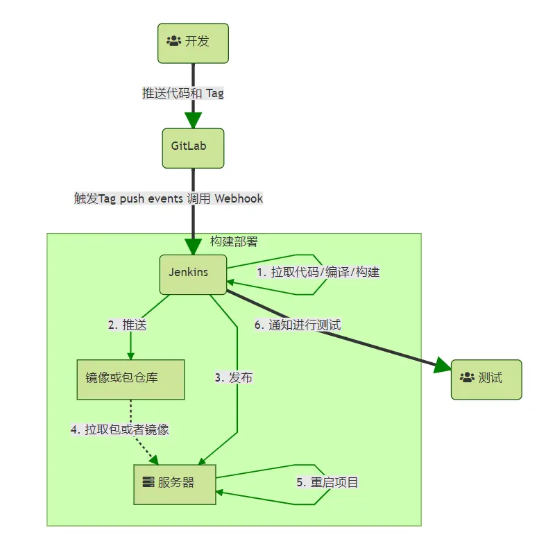

1. 开发提交代码。

2. 开发对需要发布的版本打上 **Tag** 。

3. 触发 **GitLab** 的 **tag push** 事件，调用 **Webhook** 。

4. **Webhook** 触发 **Jenkins** 的构建任务。

5. **Jenkins** 构建完项目可以按版本号上传到仓库、部署、通知相关人员等等。

### 安装 GitLab

---

[GitLab 官方文档](https://docs.gitlab.com/ee/install/docker.html) 已经介绍的比较详细了，这里不再赘述，下面给出最终调整过的 [Docker Compose](https://docs.docker.com/compose/compose-file) 配置（ [参考](https://hub.docker.com/r/twang2218/gitlab-ce-zh) ）：

```yaml
gitlab:
  image: "twang2218/gitlab-ce-zh:11.0.2"
  restart: always
  hostname: 'gitlab'
  ports:
    - "10022:10022"
    - "10086:10086"
    # postgresql 端口
    - "5432:5432"
  volumes:
    - ./gitlab/data:/var/opt/gitlab
    - ./gitlab/log:/var/log/gitlab
    - ./gitlab/config:/etc/gitlab
  environment:
    GITLAB_OMNIBUS_CONFIG: |
      # 仓库路径，填写宿主机的域名或 IP
      external_url 'http://192.168.xxx.xxx:10086'
      # ssh 连接端口
      gitlab_rails['gitlab_shell_ssh_port'] = 10022

      # 调整工作进程数减小内存占用，最小为 2
      unicorn['worker_processes'] = 2
      # 设置时区
      gitlab_rails['time_zone'] = 'Asia/Shanghai'

      # 邮箱配置
      gitlab_rails['gitlab_email_from'] = '<your_email>'
      gitlab_rails['gitlab_email_display_name'] = '<your_email_name>'
      gitlab_rails['smtp_enable'] = true
      gitlab_rails['smtp_address'] = 'smtp.163.com'
      gitlab_rails['smtp_port'] = 25
      gitlab_rails['smtp_user_name'] = "<your_email_account>"
      gitlab_rails['smtp_password'] = "<your_email_password>"
      gitlab_rails['smtp_domain'] = 'smtp.163.com'
      gitlab_rails['smtp_tls'] = false
      gitlab_rails['smtp_openssl_verify_mode'] = 'none'
      gitlab_rails['smtp_enable_starttls_auto'] = false
      gitlab_rails['smtp_ssl'] = false
      gitlab_rails['smtp_force_ssl'] = false

      # 数据库配置
      gitlab_rails['db_host'] = '127.0.0.1'
      gitlab_rails['db_port'] = 5432
      gitlab_rails['db_username'] = "gitlab"
      gitlab_rails['db_password'] = "gitlab"

      postgresql['listen_address'] = '0.0.0.0'
      postgresql['port'] = 5432
      postgresql['md5_auth_cidr_addresses'] = %w()
      postgresql['trust_auth_cidr_addresses'] = %w(0.0.0.0/0)
      postgresql['sql_user'] = "gitlab"
      postgresql['sql_user_password'] = Digest::MD5.hexdigest "gitlab" << postgresql['sql_user']

      # 备份设置-保留7天
      gitlab_rails['backup_keep_time'] = 604800
    GITLAB_BACKUPS: "daily"
    GITLAB_SIGNUP: "true"
    GITLAB_ROOT_PASSWORD: "lb80h&85"
    GITLAB_GRAVATAR_ENABLED: "true"
```

说明：

- 这里使用 **汉化版** 镜像，如果不适应可以换回 **官方原版** 镜像 `gitlab/gitlab-ce:11.0.2-ce.0` 。

- 项目初始配置 + 启动很慢，需要一段时间，日志中出现 **Reconfigured** 时表示启动成功。

- **192.168.xxx.xxx** 替换为宿主机的 **IP** 地址。

- 初始管理员账号密码： `root` / `lb80h&85` （ **自行修改配置文件中的密码** ）。

- 该配置为 **乞丐版** ，内存占用 **2G+** （ **worker_processes** 越多内存占用越大，默认为 **8G** ）。

- **postgresql** 为容器中内置的数据库（ 账号密码： `gitlab` / `gitlab` ），非必要情况就不要暴露端口了。

- 邮箱填写用于 **发送找回密码和通知** 的发件人账号（ [收不到邮件？](https://www.cnblogs.com/wenwei-blog/p/6286944.html) ），不想配邮箱可以删掉相关配置，不影响正常使用（ **注册账号时邮箱可以随便填** ）。

- **如果指定了 `external_url` ，那么其中的端口号就是用于 NGINX 监听的端口号（ 如果 `nginx['listen_port']` 没有显式配置 ），所以上面配置中的端口映射是 `10086:10086` 而非 `10086:80` 。（ [参考](https://www.jianshu.com/p/d707f70c60d2) ）**

  [Expose GitLab on different ports](https://docs.gitlab.com/ee/install/docker.html#expose-gitlab-on-different-ports)

- **由于安全问题，新版本浏览器禁用了 `10080` 端口的访问，可以换成其他端口。（ [参考](https://zning.me/16236378724281.html) ）**

### 安装 Jenkins

---

为了测试方便，本文中使用 **Docker** 化的 **Jenkins** ，如果需要调用一些特殊的命令或脚本就不是很方便，实际使用过程中可以换成普通版的。

[Docker Compose](https://docs.docker.com/compose/compose-file) 配置如下：

```yaml
version: '3'
services:
  jenkins:
    image: jenkins/jenkins:2.456
    container_name: jenkins
    networks:
    - net
    user: "root"
    restart: always
    ports:
    - 9000:8080
    environment:
    - JAVA_OPTS="-Duser.timezone=Asia/Shanghai"
    volumes:
    - /etc/localtime:/etc/localtime:ro
    - ./data:/var/jenkins_home:rw
    - ./backup:/var/jenkins_backup:rw
# 网络配置
networks:
  net:
    driver: bridge
    ipam:
      driver: default
      config:
      - subnet: 172.23.0.0/16
```

说明：

- 初次启动请打印日志，日志中有管理员账号的初始密码，第一次登录的时候需要用到。

  ```shell
  Jenkins initial setup is required. An admin user has been created and a password generated.
  Please use the following password to proceed to installation:

  db7bb60324dc4331bc0dd3e79cc499a5

  This may also be found at: /var/jenkins_home/secrets/initialAdminPassword
  ```

- 为了方便，使用了 **root** 账号启动 **Docker** 容器，如果使用默认账号启动还需要修改本地目录（ data、backup ）的读写权限。

- 初始化过程中有些插件可能搜不到，可以在账号初始化结束后再进入设置页面安装插件。

### 配置 GitLab

---

注册账号什么的就不赘述了，建一个测试项目 **test** ，随便 **commit** 几条内容。

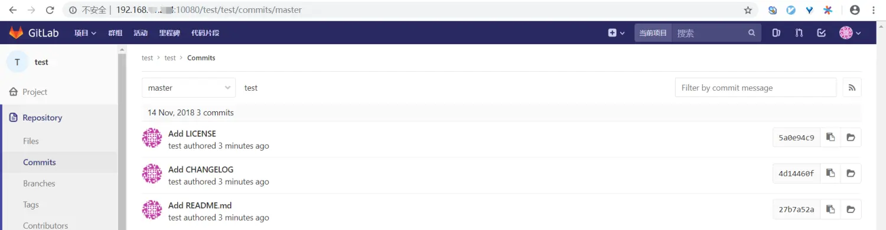

按下图步骤创建账号的 **access token** ，用于 **Jenkins** 调用 **GitLab** 的 **API** 。

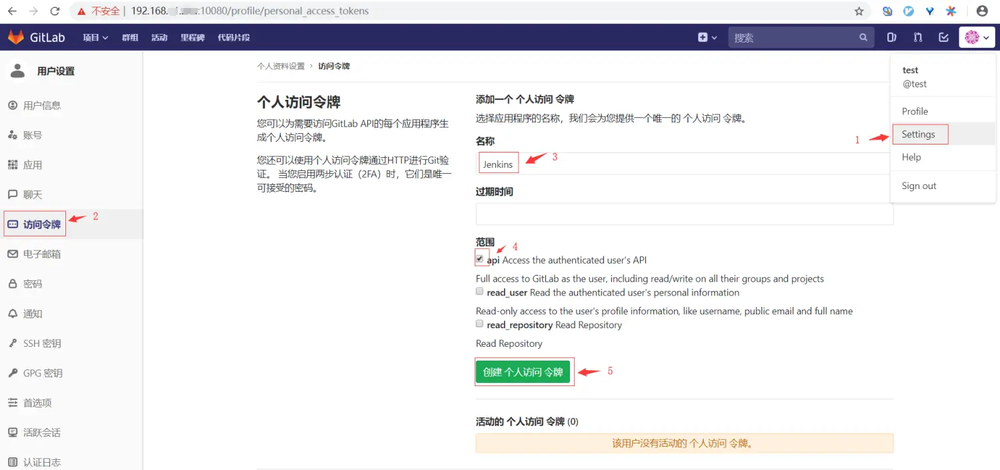

---

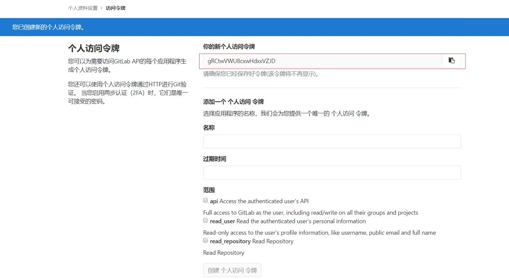

记下这里生成的 **access token** （ `gRCtwVWU8cxwHdxxVZJD` ），后面要用到。

### 配置 Jenkins

---

- **安装插件**

  > 安装过程可能会失败，多试几次就好了，可以尝试更新 **Jenkins** 。

  | 插件                                                                                                  | 说明                                |
  | ----------------------------------------------------------------------------------------------------- | ----------------------------------- |
  | [Git Parameter](https://wiki.jenkins.io/display/JENKINS/Git+Parameter+Plugin)                         | 用于参数化构建中动态获取项目分支。  |
  | [Generic Webhook Trigger](https://wiki.jenkins-ci.org/display/JENKINS/Generic+Webhook+Trigger+Plugin) | 用于解析 **Webhook** 传过来的参数。 |
  | [GitLab](https://wiki.jenkins-ci.org/display/JENKINS/GitLab+Plugin)                                   | 用于推送构建结果给 **GitLab** 。    |

- **添加 GitLab 凭据**

  > 凭据 -> 系统 -> 全局凭据 -> 添加凭据，把上面 **GitLab** 中生成的 **access token** 填进去。

  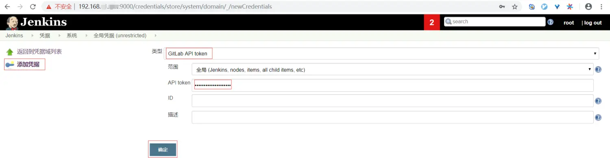

- **配置 GitLab 连接**

  > 系统管理 -> 系统设置 -> **GitLab** 配置项，填入 **GitLab** 相关的配置，后面配置项目时用到。

  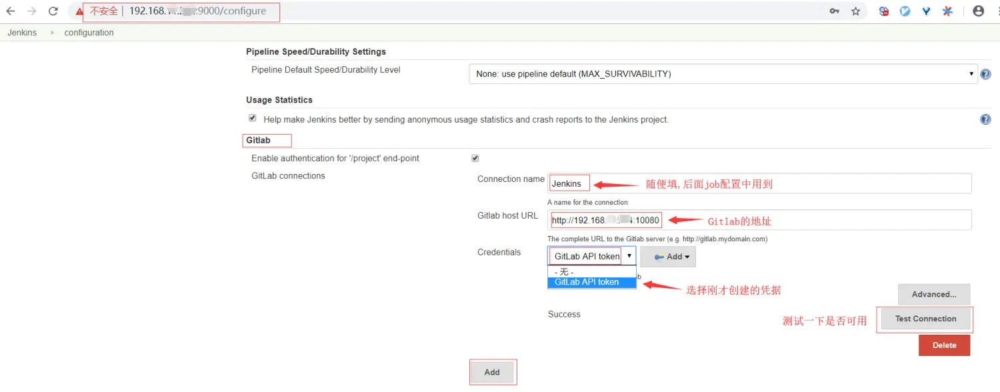

- **新建项目 test**

  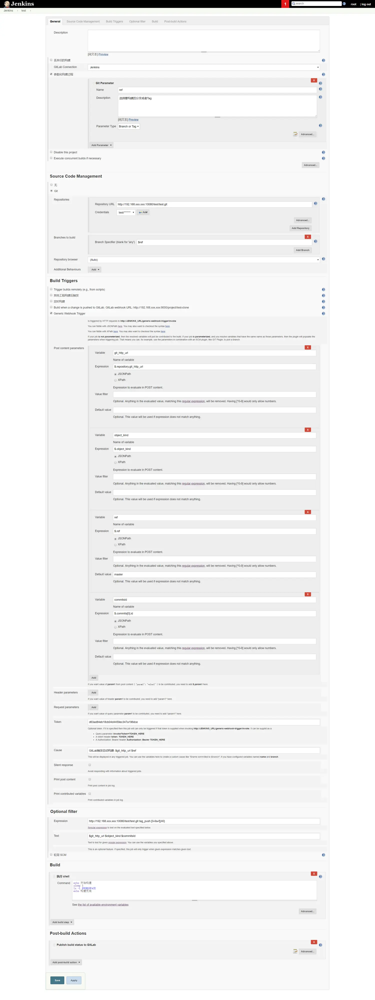

  新建一个 **Job** （ 构建一个多配置项目 ），大部分配置可以按上图照抄：

  - **勾选** 参数化构建过程，添加 **Git Parameter** 类型的参数 **ref** ，这样手动点击构建按钮（ `Build with Parameters` ）的时候就可以指定分支进行构建。

  - **Source Code Management** 选择 **Git** ，添加项目地址和授权方式（ **账号密码** 或者 **ssh key** ，不能选 **GitLab API token** ），分支填写构建参数 **$ref** 。

  - **Build Triggers** 选择 **Generic Webhook Trigger** 方式用于解析 **GitLab** 推过来的详细参数，其中 **Token** 用 [GUID / UUID](https://www.guidgenerator.com/online-guid-generator.aspx) 生成一个。

    **用法说明：** 在 **GitLab** 的 **Webhook** 编辑页面中点击 **View details** 查看调用详情，其中 **Request body** 就是传递给 **Jenkins** 的参数，利用 **JSONPath** 语法（ [在线测试](http://jsonpath.com) ）将这个大的 **JSON** 解析为一个个小的自定义参数用于后面的构建流程。

    其他触发方式中： [Trigger builds remotely](https://www.cnblogs.com/jwentest/p/8204421.html) 是 **Jenkins** 自带的， **Build when a change is pushed to GitLab** 是 **GitLab 插件** 提供的，都属于简单的触发构建，无法做复杂的处理。

  - 虽然 **Generic Webhook Trigger** 提供了 **Token** 参数进行鉴权，但为了避免不同项目进行混调（ 比如 **A** 项目提交代码却触发了 **B** 项目的构建 ），还要对请求做下过滤。 **Optional filter** 中 **Text** 填写需要校验的内容（ 可使用变量 ）， **Expression** 使用正则表达式对 **Text** 进行匹配，匹配成功才允许触发构建。

  - **Build** 内容按自己实际的项目类型进行调整，使用 **Maven 插件** 或 **脚本** 等等。

  - **GitLab Connection** 选择上面添加的 **GitLab 连接（ `Jenkins` ）** ， **Post-build Actions** 添加 `Publish build status to GitLab` 动作，实现构建结束后反馈构建结果给 **GitLab** 。

- 回到 **GitLab** 的项目页面中，添加一个 **Webhook** ：

  ```shell
  http://JENKINS_URL/generic-webhook-trigger/invoke?token=<上面 Jenkins 项目配置中的 token>
  ```

  触发器选择 **标签推送事件** 。因为日常开发中 **push** 操作比较频繁而且不是每个版本都需要构建，所以只针对需要构建的版本打上 **Tag** 就好了。

  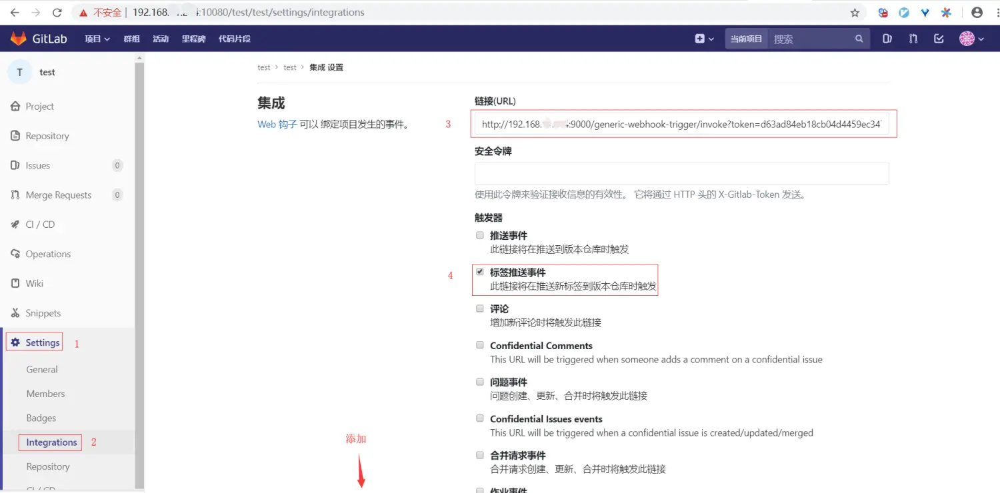

  创建完使用 **test 按钮** 先测试下，可能会出现下面的错误：

  > Hook execution failed: URL 'http://192.168.xxx.xxx:9000/generic-webhook-trigger/invoke?token=d63ad84eb18cb04d4459ec347a196dce' is blocked: Requests to the local network are not allowed

  **解决办法： [允许 GitLab 本地网络发送 Webhook 请求](https://www.cnblogs.com/sxdcgaq8080/p/10592806.html) 。**

### 测试效果

---

可以在 **GitLab** 上直接添加 **Tag** ，不过我觉得用 **IDEA** 操作更方便点，就把代码拉下来在本地操作。

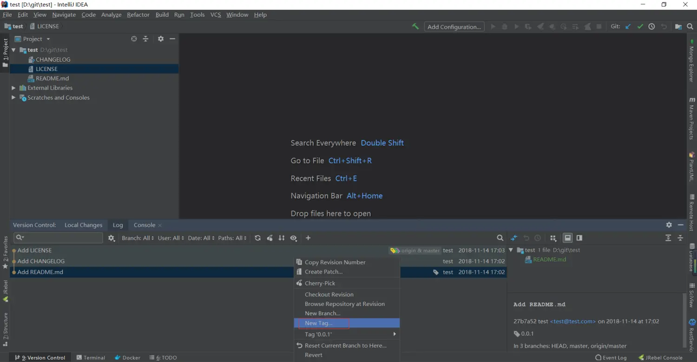

使用快捷键 `Ctrl + Shift + K` 调出 **Push 窗口** ，把 **Tag** 推送到 **GitLab** 中。

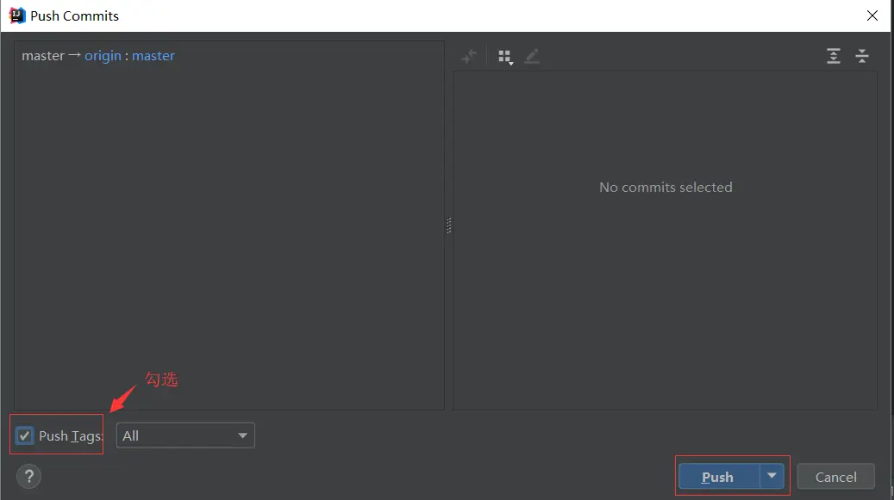

回到 **GitLab** 页面可以看到触发了 **Webhook** ， **View details** 查看请求详情， **Response body** 中 `triggered` 字段值为 `true` 则表示成功触发了 **Jenkins** 的构建。

如果 `triggered` 字段值为 `false` 很可能是 **Optional filter** 中实际的 **Text** 值和正则表达式 **Expression** 不匹配（ 见 **Response body** 中 `regexpFilterText` 和 `regexpFilterExpression` 的具体值 ），比如删除 **Tag** 的时候没有 **commitsId** 就不会匹配上。

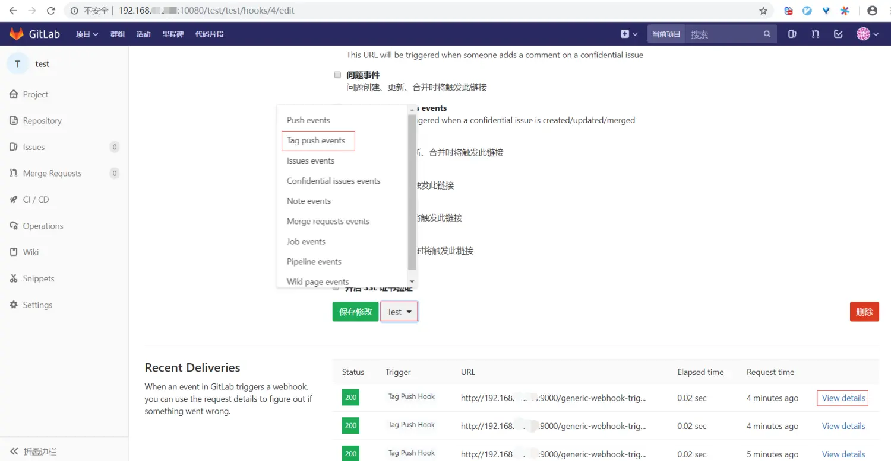

再看下构建结果：

> 见上面的 `Publish build status to GitLab` 。

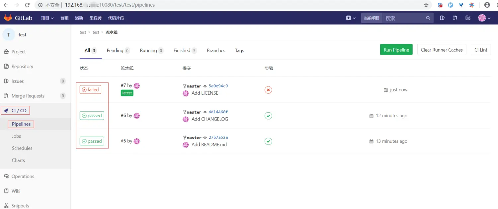

---

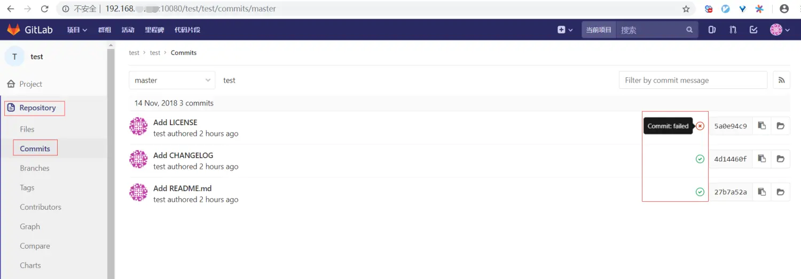

**注意：** 每添加一个 **Tag** 就会触发一次事件，不管是不是一起 **push** 的。所以一次 **push** 多个 **Tag** 会触发 **Jenkins** 进行多次构建。不过 **Jenkins** 已经做了处理，默认串行执行任务（ 一个任务结束后再执行下一个 ），而且在构建前有一个 **pending** 状态，此时被多次触发会进行合并，并取首次触发的参数，如下图所示：

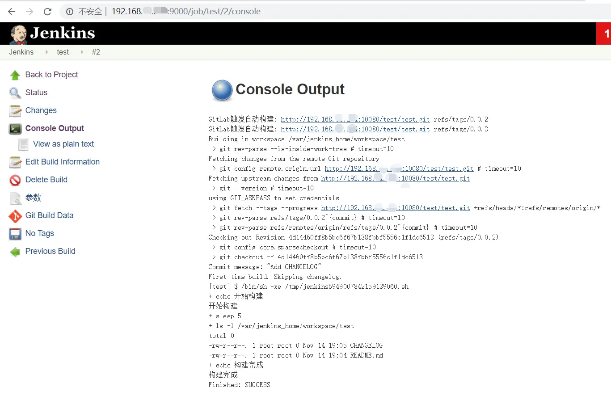

> 测试发现新版 **Jenkins** 似乎不再合并构建了。

### 关于 Tag 的几点说明

---

- 推送 **Tag** 到远端的时候，远端已存在（ 同名 ）的 **Tag** 不会被添加到远端。

- 拉取远端的 **Tag** 时，本地已存在（ 同名 ）的 **Tag** 不会添加到本地。

- 拉取远端的 **Tag** 时，本地不会删除远端已删除的 **Tag** ，需要同步远端的 **Tag** 可以先删除本地所有 **Tag** 再进行 **pull** 。

- 删除 **Tag** 也会推送事件，要做好过滤（ 上面配置中已使用 **commitsId** 字段进行过滤 ）。

### 后续

---

**通过上面的步骤已经初步实现了想要的效果，还有几个点后续可以再考虑下：**

- 上文只包含自动构建的内容，对于项目的部署可以考虑几种方式：手动选择指定的版本进行发布、构建任务结束后直接触发部署任务、定时部署最新版本（ 根据实际需求调整 ）。

- 测试发版的频率会比较高，会生成大量的 **Tag** ，可以约定 **Tag** 的格式，比如用 `test 0.0.1` 表示触发测试环境的项目构建，用 `online 1.0.0` 表示触发正式版本构建，隔离之后可以方便后续的维护和清理。

- 构建部分可以整合 **Docker** ，把构建结果打包到 **Docker** 镜像中（ 代码版本库的 **Tag** 正好可以作为镜像的 **Tag** ），再上传到 **Docker** 镜像仓库（ [私服](https://docs.docker.com/registry) 或者第三方仓库 ）中，后续部署就可以直接从镜像仓库拉取镜像直接运行了。

- 集成自动化测试 ，比如 [这个](https://www.yiibai.com/jenkins/jenkins_automated_testing.html) 。

- 尝试配置 **GitLab** 自带的 [CI / CD](https://docs.gitlab.com/ee/ci) 。

### 相关

---

- **[使用 semantic-release 自动发版](https://www.jianshu.com/p/738f13665bee)**

### 总结

---

以上就是对曾经踩过的一些坑进行的整合，也没什么好总结的。总之，合理地利用现有工具来解放双手，就能有更多时间做其他想做的事！

时间有限一些基础的步骤就不细讲直接一笔带过了，方案上可能有些细节方面也没考虑全，欢迎评论留言。

---

#### 转载请注明出处： [https://www.jianshu.com/p/7e8037c63d63](https://www.jianshu.com/p/7e8037c63d63)
