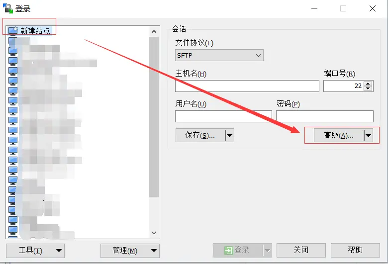

### 前言

---

平时经常遇到下面的情况：

1. 工作没做完，想回家继续做。带电脑回家？
2. 碰到以前做过的功能，想从家里的电脑捞一点代码。没独立 **IP** 怎么访问？
3. 服务器只允许公司网络访问，在外面要登服务器。找领导设置安全组权限（ 或者防火墙 ）？
4. 在外面想访问公司局域网中的某个服务，比如 **Gitlab** ？
5. 公司网络不能逛淘宝？

一般情况下的对应方法：

1. 远程连接（ 比如 **Windows** 自带的 ）
2. **NAT** 内网穿透（ 比如花生壳，几年前用过免费版的，不太稳定， **Linux** 下安装也不太顺畅 ）
3. 一般需要正当理由
4. 公司有固定公网 **IP** 的话，路由器设置端口转发，不过路由器权限呢？
5. 代理服务器

本文的目的就是使用 **SSH TUNNEL** 这项技术解决上面的问题，也就是打通所谓的 **公司网络** 和 **家里网络** 。

### SSH TUNNEL 简介

---

经常远程连接 **Linux** 服务器的小伙伴，对于 **ssh** 这个命令应该不陌生吧。它还可以不执行远程指令只建立一条和远程服务器之间的连接，也就是形成了一条通道，在这条通道上我们就可以做一些文章了。
先看下 **ssh** 命令的参数介绍（ 需要了解更多请通过命令 [`man ssh`](https://linux.die.net/man/1/ssh) 查看 ）

```shell
-1: 强制使用ssh协议版本1；
-2: 强制使用ssh协议版本2；
-4: 强制使用IPv4地址；
-6: 强制使用IPv6地址；
-A: 开启认证代理连接转发功能；
-a: 关闭认证代理连接转发功能；
-b: 使用本机指定地址作为对应连接的源IP地址；
-C: 请求压缩所有数据；
-F: 指定ssh指令的配置文件；
-f: 后台执行ssh指令；
-g: 允许远程主机连接主机的转发端口；
-i: 指定身份文件；
-l: 指定连接远程服务器登录用户名；
-N: 不执行远程指令；
-o: 指定ssh客户端配置选项来覆盖配置文件中的配置,比如: -o "StrictHostKeyChecking no" 可以去除检查主机的提示；
-p: 指定远程服务器上的ssh端口（ 默认为22 ）；
-q: 静默模式；
-X: 开启X11转发功能；
-x: 关闭X11转发功能；
-y: 开启信任X11转发功能。

-D: 监听本地的指定端口，本机将作为 SOCKS5 服务器使用
-L: 本地监听指定端口，该端口收到的请求会通过远程服务器转发到另一台机器的指定端口上
-R: 远程服务器上监听指定端口，该端口收到的请求会通过本地转发到另一台机器的指定端口上
```

关键的就是最后的三个参数，对应 **SSH 隧道** 的三种端口转发模式：本地转发（ `-L Local` ），远程转发（ `-R Remote` ）和动态转发（ `-D Dynamic` ）

#### 本地转发

**本地监听指定端口，该端口收到的请求会通过远程服务器转发到另一台机器的指定端口上**

- 语法：

  ```shell
  $ ssh [-p ssh_port] -L [bind_address:]port:host:hostport user@remote_host

  解释：
      port: 本地监听的端口
      bind_address: 监听端口使用的本地地址（ 如 192.168.1.2, 127.0.0.1, 0.0.0.0 ），不设置时默认为回环地址（ 127.0.0.1 ）
      host: 转发的目标 IP
      hostport: 转发的目标端口
  注意：
      host:hostport 是远程主机 user@remote_host:ssh_port 所能访问到的地址（ 包括 user@remote_host 自己 ），本地主机不一定能访问该地址
  ```

- 示例：

  ```shell
  $ ssh -p 23 -Nf -L 0.0.0.0:3000:123.123.123.124:3001 root@123.123.123.123

  说明：
      1. 通过 23 端口 ssh 远程服务器 123.123.123.123，使用帐号 root 登录
      2. 本地监听端口 0.0.0.0:3000
      3. 123.123.123.124 和 123.123.123.123 在一个局域网下，而本地不能直接访问 123.123.123.124
      4. 123.123.123.124 主机通过 3001 端口开放服务
      5. 调用链路：本地访问 --> 127.0.0.1:3000 -- ssh 隧道 --> 123.123.123.123 -- 转发 --> 123.123.123.124:3001
  ```

  上面示例中相当于将远程主机 **123.123.123.124** 的 **3001** 端口映射为本地的 **3000** 端口，这样就可以通过局域网访问被限制的公网服务了。

#### 远程转发

**远程服务器上监听指定端口，该端口收到的请求会通过本地转发到另一台机器的指定端口上**

- 语法：

  ```shell
  $ ssh [-p ssh_port] -R [bind_address:]port:host:hostport user@remote_host

  解释：
      语法和 -L 一样，只不过监听侧和目标侧的网络对换而已
      port: 在远程主机 user@remote_host 上监听的端口
      bind_address: 远程主机 user@remote_host  监听端口使用的地址（ 如 remote_host, 127.0.0.1, 0.0.0.0 ）。和 -L 有点区别，指定 IP 需要在远程主机上修改 /etc/ssh/sshd_config 中的配置 GatewayPorts
        "yes" 表示 强制为 0.0.0.0
        "no" 表示 强制为回环地址（ 127.0.0.1 ） （ 默认 ）
        "clientspecified" 表示 由客户端决定
      host: 转发的目标 IP
      hostport: 转发的目标端口
  注意：
      host:hostport 是本地主机所能访问到的地址（ 包括本机 ），远程主机 user@remote_host:ssh_port 不一定能访问该地址
  ```

- 示例：

  ```shell
  $ ssh -p 23 -Nf -R 172.17.0.1:3000:192.168.1.100:3001 root@123.123.123.123

  说明：
      1. 通过 23 端口 ssh 远程服务器 123.123.123.123，使用帐号 root 登录
      2. 123.123.123.123 监听端口 172.17.0.1:3000 （ 我的远程服务器运行着 docker 所以有一个虚拟网络 172.17.0.0 ）
      3. 192.168.1.100 和 本地主机 在一个局域网下，而 123.123.123.123 （ 外网 ）不能直接访问 192.168.1.100 （ 内网 ）
      4. 192.168.1.100 主机通过 3001 端口开放服务
      5. 调用链路：远程服务器中访问 --> 172.17.0.1:3000 -- ssh 隧道 --> 本地 -- 转发 --> 192.168.1.100:3001
  ```

  上面示例中相当于将局域网主机 **192.168.1.100** 的 **3001** 端口映射为远程服务器 **123.123.123.123** 的 **3000** 端口，这样就可以通过公网来访问局域网中的服务了。

#### 动态转发

**监听本地的指定端口，本机将作为 SOCKS5 服务器使用**

- 语法：

  ```shell
  $ ssh [-p ssh_port] -D [bind_address:]port user@remote_host

  解释：
      port: 本地监听的端口
      bind_address: 监听端口使用的本地地址（ 如 192.168.1.2, 127.0.0.1, 0.0.0.0 ），不设置时默认为回环地址 （ 127.0.0.1 ）
  注意：
      启动 socks5 代理
  代理测试示例：
      curl --socks5 bind_address:port baidu.com
  ```

- 示例：

  ```shell
  $ ssh -p 23 -Nf -D 127.0.0.1:3000 root@123.123.123.123

  说明：
      1. 通过 23 端口 ssh 远程服务器 123.123.123.123，使用帐号 root 登录
      2. 本地监听端口 127.0.0.1:3000
      3. 调用链路：本地局域网中访问任意 http 服务 -- 使用代理 --> 172.17.0.1:3000 -- ssh 隧道 --> 123.123.123.123 -- 转发 --> 目标 http 服务
  ```

  上面示例中相当于开启了一个 **代理服务器** ，比起 **本地转发** 需要指定具体端口来说更加方便。

### 正文

---

上面已经介绍了 **SSH TUNNEL** 的使用方式，接下来就开始干正事了，先上两张网络拓扑图。


---


对比两张图把少的线连上就好了，是不是很 easy ?

- **原先环境：**
  三个独立的网络： **公司内网** 、 **家里内网** 、 **阿里云专有网络** ，其中可以通过 **公司网络** 访问 **阿里云** 上的服务器而 **家里网络** 则不行。

- **目标：**

  1. 使 **家里网络** 的主机能访问 **公司内局域网** 中的主机
  2. 使 **家里网络** 的主机能访问 **公司阿里云** 上的服务器

- **预备工作：**

  1. 有一台公网的服务器作为 **跳板机** ，公司和家里都能访问到它

     （ 没有服务器？阿里云腾讯云学生机弄台玩玩 ）

  2. 因为 **ssh** 命令不能添加密码作为参数，只能手动输入，而且每次连接都要重新输入也不是很方便，这里采用 **公钥方式** 登录就可以免输密码了

     ```shell
     # 创建 ssh 密钥对
     $ ssh-keygen -t rsa -b 4096 -C "备注1"

     # 远程服务器上的 ~/.ssh/authorized_keys 权限要是 600
     # 追加本机公钥到远程服务器
     $ cat ~/.ssh/id_rsa.pub | ssh -p 23 root@123.123.123.123 "cat - >> ~/.ssh/authorized_keys"

     # 或者直接复制本机公钥到远程服务器（ 会覆盖掉远程服务器已有的其他公钥 ）
     $ scp -P 23 -p ~/.ssh/id_rsa.pub root@123.123.123.123:~/.ssh/authorized_keys
     ```

- **步骤：**

  1. 将 **公司主机 A** 的端口 **22** 映射到 **跳板机 J** 的端口 **9999** 上，在 **公司主机 A** 按照下面的命令配置（ **跳板机 J** 需要按上文中的方式将 **GatewayPorts** 设为 `true` ）

     ```shell
     $ ssh -p 23 -Nf -R 9999:127.0.0.1:22 root@123.123.123.123
     ```

     当然也可以通过 **docker** 运行 **autossh** 来使这个隧道可以自动重连

     ```yaml
     # 暴露本地 ssh 端口到远端服务器端口
     ssh-to-expose-ssh-server:
       image: jnovack/autossh
       container_name: autossh-ssh-to-expose-ssh-server
       # 使用宿主机的网络
       network_mode: host
       environment:
         - SSH_HOSTUSER=root
         - SSH_HOSTNAME=123.123.123.123
         - SSH_HOSTPORT=23
         - SSH_TUNNEL_REMOTE=9999
         - SSH_TUNNEL_HOST=127.0.0.1
         - SSH_TUNNEL_LOCAL=22
       restart: always
       volumes:
         - ~/.ssh/id_rsa:/id_rsa
     ```

     这样在 **跳板机 J** 上就可以通过 `ssh -p 9999 root@127.0.0.1` 远程连接到 **公司主机 A** 了

  2. 在 **跳板机 J** 上设置动态转发使其作为 **代理服务器** ，将接收到的请求再转发到 **公司主机 A**

     在 **跳板机 J**上执行下面的命令

     ```shell
     $ ssh -p 9999 -Nf -D 0.0.0.0:1080 root@127.0.0.1
     ```

     同样的，要把 **跳板机 J** 的 **公钥** 复制到 **公司主机 A** 上实现免密登录

     ```shell
     # 创建 ssh 密钥对
     $ ssh-keygen -t rsa -b 4096 -C "备注2"
     # 追加本机公钥到远程服务器
     $ cat ~/.ssh/id_rsa.pub | ssh -p 9999 root@127.0.0.1 "cat - >> ~/.ssh/authorized_keys"
     ```

     当然也可以使用 **docker** 启动 **autossh**

     ```yaml
     # 使用 SSH TUNNEL 创建 SOCKS5 代理
     ssh-tunnel-socks5-server:
       image: jnovack/autossh
       container_name: ssh-tunnel-socks5-server
       entrypoint:
         autossh
          -M 0
          -N
          -o ServerAliveInterval=5
          -o ServerAliveCountMax=1
          -o "ExitOnForwardFailure yes"
          -o "StrictHostKeyChecking no"
          -t -t
          -i /id_rsa
          -D 0.0.0.0:1080
          -p 9999
          # 使用宿主机的IP
          root@172.17.0.1
       ports:
         - "1081:1080"
       restart: always
       volumes:
         - ~/.ssh/id_rsa:/id_rsa
     ```

  这样 **家里主机 F** 就可以通过设置代理 **跳板机 J** 连接上 **阿里云** 上的服务器了。

  原理： **公司主机 A** 和 **跳板机 J** 联合组成 **代理层** 。调用链路为： **家里主机 F** -- 使用代理 --> **跳板机 J** -- ssh 隧道 --> **公司主机 A** -- 转发 --> **阿里云** 服务器。

  **注** ：组成 **代理层** 还有另一种方式： **公司主机 A** 开代理服务同时把端口远程暴露到 **跳板机 J** 上，通过这种方式就可以配置代理服务的密码了，具体配置参照 [这里](https://github.com/anyesu/SSH-Tunnel/blob/master/client-side/docker-compose-proxy.yml) 。

**就这么两步配置已经打通公司网络和家里网络了。不过，貌似实现的效果是单向的诶（ 只能家里连公司，公司还不能连家里，如下图所示 ）**


解决办法： **家里主机 F** 按 **公司主机 A** 的步骤再配一遍就好啦。

### 拓展

---

- **使用代理访问受限制的网站（ 比如公司内网的项目 ）：**

  1. 由于代理服务器使用的是 **SOCKS5** 协议， **Chrome** 上安装 **SwitchyOmega** 插件配置代理服务器地址，即可通过代理服务器访问受限制的服务了。

  2. 将 **SOCKS5** 协议转为 **HTTP** 协议，然后通过系统自带的方式（ **Win** 下设置 **IE** 的 **Internet 属性** ，移动设备设置 **WIFI 的 HTTP 代理** ）来设置全局代理， **docker-compose** 配置如下：

     ```yaml
     # 使用 gost 代理 SOCKS5 端口
     gost-server:
       image: ginuerzh/gost
       command: -L=:8080 -F=socks5://ssh-to-local-proxy:1080
       ports:
         - "1082:8080"
     restart: always

     # 使用 privoxy 代理 SOCKS5 端口
     privoxy:
       image: rdsubhas/tor-privoxy-alpine
       entrypoint: sh -c 'echo "listen-address 0.0.0.0:8118" > /etc/service/privoxy/config && echo "forward-socks5 / ssh-to-local-proxy:1080 ." >> /etc/service/privoxy/config && privoxy --no-daemon /etc/service/privoxy/config'
       ports:
       - "1083:8118"
       restart: always
     ```

     这里给出两种转换方式： [gost](https://github.com/ginuerzh/gost) 和 [privoxy](https://blog.csdn.net/dounine/article/details/53028747) ，选择其中一种方式即可。 **privoxy** 找不到纯净的镜像，都是捆绑 **tor** 的，就挑一个最精简的来做修改吧。

  3. 其实还可以在 **公司主机 A** 搭建 **SS 服务器** ，然后就可以通过 **SS 客户端** 来连接代理。具体的本文就不细说了，搭建示例可以看 [这里](https://github.com/anyesu/SSH-Tunnel/tree/master/client-side) 对应的 **compose** 文件。

- **终端工具中使用代理来连接云服务器**
  这里的例子使用 **WinSCP** ，其他工具应该也差不多：新建站点 -> 编辑 -> 高级 -> 连接

  

  1. **ssh 隧道方式** ：使用 **跳板机 J** 的 **9999** 端口加 **公司主机 A** 的帐号、密码、端口。

     

  2. **代理方式** ：可以选择 **SOCKS5** 协议或者 **HTTP** 协议，和上面的配置一致即可。

     

### 其他问题

---

1. SSH 连接可能会中断（ 临时的网络拥塞、 SSH 超时、中继主机重启等等 ），所以可以借助 **autossh** 实现自动重连来保证可靠的服务。
2. SSH 连接有 **超时断开** 的机制， **WinSCP** 有时会不断提示 **断开重连** ，有两种方式来维持连接：
   1. 设置 -> 面板 -> 远程 -> 修改刷新面板间隔为 30s 或者更短
   2. session 设置 -> 高级 -> 连接 -> keepalives -> 执行哑命令（ 空 SSH 包是没效果的 ）
3. **Win10 1803** 已经默认集成了 **SSH 工具** ，可以直接使用上面的命令。当然也可以借助终端工具来建立 **SSH 隧道** ，比如在 [`MobaXterm`](https://blog.csdn.net/u010520552/article/details/80823953) 上可以使用图形界面进行设置，比较直观。
4. 文中的方法使用 **两级代理三次转发（ 如果在 docker 中运行那就是四次转发 ）** 实现不同网络的访问，中间代理层的 **带宽** 就限制了整体的访问速度，需要注意下。
5. **跳板机** 提供的 **SOCKS5** 代理服务没有密码，如果被别人知道了 **IP** 和端口容易被恶意攻击，所以一定要做好安全措施（ 比如 **安全组** 或 **防火墙** 限制 **跳板机** 的入网 **IP** 为自己指定的 **IP** ）。
6. 你公司其他同事也想连你家里的电脑？总不能把 **跳板机** 暴露给他吧，太不安全了，你本地再开一层代理，让他用你的电脑作为代理好了。

### 仓库

---

基于 **docker-compose** 运行的完整配置已经上传至 [GitHub](https://github.com/anyesu/SSH-Tunnel) 。

### 参考文章

---

- [SSH 隧道技术----端口转发，socket 代理](https://www.cnblogs.com/fbwfbi/p/3702896.html)
- [通过 SSH 实现 TCP / IP 隧道（端口转发）：使用 OpenSSH 可能的 8 种场景](https://linux.cn/article-8945-1.html)
- [winScp 如何通过隧道代理进行远程连接](https://www.cnblogs.com/wangkongming/p/4124945.html)
- [ssh tunnel 三种模式](https://github.com/caojx-git/learn/blob/master/notes/linux/ssh%20tunnel%20%E4%B8%89%E7%A7%8D%E6%A8%A1%E5%BC%8F_2.md)
- [SSH Tunnel | SSH.COM](https://www.ssh.com/ssh/tunneling/)
- [SSH port forwarding - Example, command, server config | SSH.COM](https://www.ssh.com/ssh/tunneling/example)

---

#### 转载请注明出处： [https://www.jianshu.com/p/388a93b1e7f7](https://www.jianshu.com/p/388a93b1e7f7)
