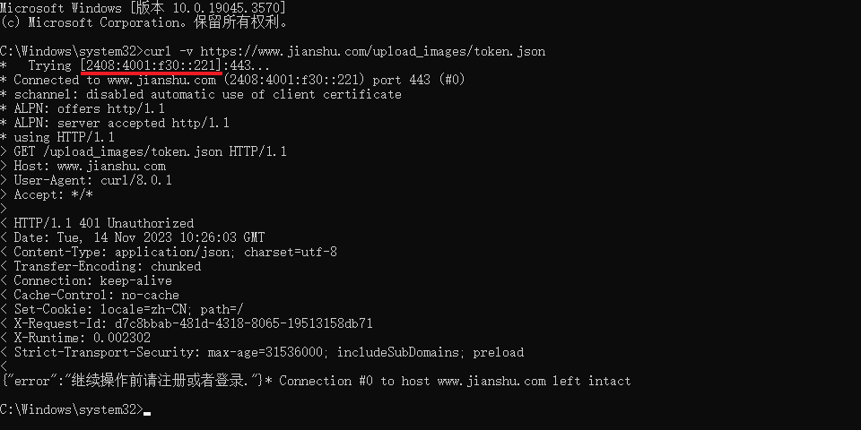
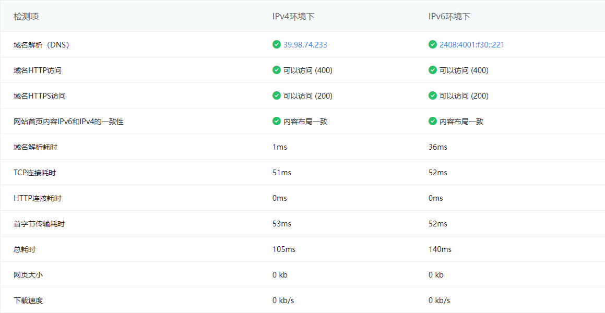

### 背景

---

这个问题最初是在 8 月份发现的，当时写完文章准备同步到简书的时候发现图片上传一直失败，打开 **F12** 一看是 [获取七牛云 token ](https://www.jianshu.com/upload_images/token.json) 这个接口返回了空数据：

```json
{"token":"","key":"upload_images/12345678-xxxxxxxxxxx"}
```

没有有效的 **token** 图片自然就无法上传到 [七牛云](https://developer.qiniu.com/kodo/1312/upload) 了。想着这么简单的问题应该很快就能解决就没去管它了。


结果，一个月过去了还是不能上传，但是发现首页一些新发布的文章都是带图片的，说明我的问题只是个例，或者是手机上传有不同的接口？

又过了几天，抱着试一试的心态上传图片，结果突然就好了。（ 此时问题实际上仍未修复 ）

### 问题复现

---

> 截止 2023 年 11 月，这个问题应该是修复了，暂时没法复现，本文仅用于记录。

最近正好打算做一个类似于 [Wechatsync](https://github.com/wechatsync/Wechatsync) 的文章同步工具，先拿简书接口试试手，代码噼里啪啦一顿写，一运行才发现接口跑不通，也是纳闷了，明明浏览器上刚跑了没问题的。

> 接口挂了就挂了，给个错误信息就好了，偏偏还返回了一个完整的 **JSON** ，字段名都有，字段值却是一个空字符串，导致我一度怀疑是 [Axios](https://github.com/axios/axios) 的锅。。。

测试了下面几种情况：

- [x] 浏览器 - **Fetch**
- [x] 浏览器 - **Ajax**
- [x] 命令行 - **curl**
- [ ] **Postman**
- [ ] **Node.js** 原生网络请求 **API**

想不通为什么最后两种情况接口访问会出错，直到用 **curl** 调试（ `-v` ）时才发现问题：域名解析后的 **IP** 地址是 [IPv6](https://wikipedia.org/wiki/IPv6) 格式的。



禁用了网卡属性中的 **IPv6** 协议，果然浏览器上也出错了。

### 解决方法

---

切换为支持 **IPv6** 的网络，目前手机网络应该都支持 **IPv6** 了吧，可以开个热点给电脑试试。

**检测方法：**

- [ipw.cn](https://ipw.cn)

- [test-ipv6.com](http://www.test-ipv6.com)

- 使用 **IPv6** 格式的 **IP** [[2408:4001:f30::221]](https://[2408:4001:f30::221]) 访问简书

  [](https://tool.chinaz.com/ipv6/www.jianshu.com)

**切换网络后不生效可以试下：**

- 禁用后再启用网卡属性中的 **IPv6** 协议

  **网络和共享中心** -> **更改适配器设置** -> **右键网卡属性** -> 勾选 / 取消勾选 **Internet 协议版本 6 (TCP/IPv6)**

- 刷新 **DNS** 缓存

  ```powershell
  ipconfig /flushdns
  ```

### 在 Node.js 中设置 IPv6 访问优先（ [参考](https://stackoverflow.com/a/74837498) ）

---

```javascript
import * as dns from 'node:dns';

export function useIpv6First() {
  dns.setDefaultResultOrder('verbatim');
}

export function useIpv4First() {
  dns.setDefaultResultOrder('ipv4first');
}
```

> **Node.js** 从 `v17.0.0` 版本起， `verbatim` 选项的默认值改为 `true` ，也就是默认优先 **IPv6** 。（ [参考](https://nodejs.org/api/dns.html#dnslookuphostname-options-callback) ）

[getDefaultResultOrder](https://nodejs.org/api/dns.html#dnsgetdefaultresultorder) **API** 在旧版本 **Node.js** 中不支持，代替方案是手动指定一种模式为 [默认值](https://github.com/anyesu/blog/blob/d854e4ce7ce9f211542abc51feeed24d009057d9/scripts/plugins/BasePlugin.ts#L24) ，想要还原的时候切换回这种模式即可。

### 其他

---

- 为什么要做一个 [文章同步的工具](https://github.com/anyesu/blog/blob/main/scripts/transform.ts)

  由于文章不是首发在简书上的（ 其他平台也是一样 ），同步过来难免要重新上传外链图片，但是图片一多就老是会上传失败。上传失败就算了，还把原文内容替换成 **[图片上传失败...(image-xxxxx)]** 的做法属实有点恶心了，一篇几万字的文章如果格式被破坏了想想就头大。而每次手动一张张图片替换也没那个时间，干脆写个小工具做自动转换。

- 简书上传图片会被压缩失真怎么办

  亲测图片文件名后缀改为 **gif** 就可以阻止压缩了。（ [参考](https://github.com/anyesu/blog/blob/d854e4ce7ce9f211542abc51feeed24d009057d9/scripts/plugins/JianShuPlugin.ts#L63-L65) ）

### 最后

---

回过头来才想起，家里有好几个无线路由器，老的路由器不支持 **IPv6** 而新的路由器支持，平常用的时候也没注意都是随机连接的，所以就出现了这个图片上传问题时好时坏的现象。

自 **IPv6** 普及以来，虽然见惯了各种 **APP** 在开屏广告上 [标注支持](https://www.zhihu.com/question/352246299) `IPv6` ，但还是头一回感受到它带来的影响。当然，像简书这样“全身心”扑在 **IPv6** 上，而 **IPv4** 服务挂了而不自知的应用也是头一回见。

**一款好的产品，它的开发者必须得是它的重度用户，否则又怎么能第一时间发现并解决问题呢？**

---

#### 转载请注明出处： [https://github.com/anyesu/blog/issues/47](https://anyesu.github.io/blog/articles/47)
