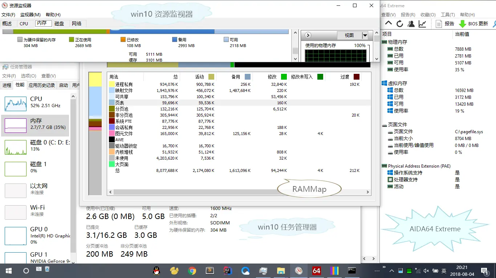
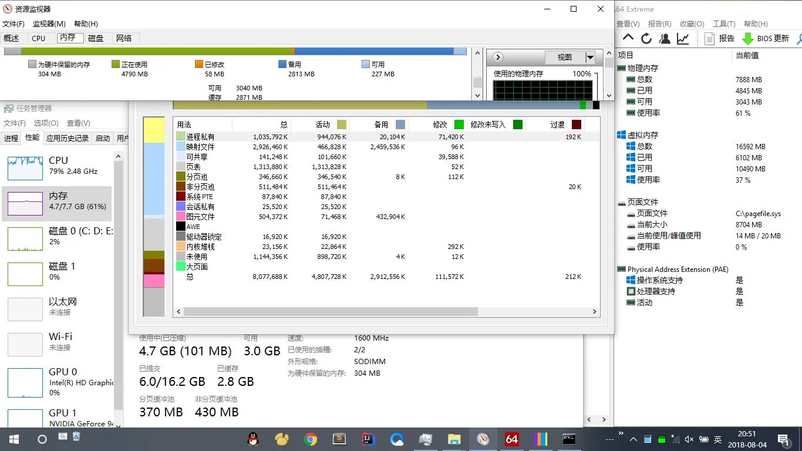
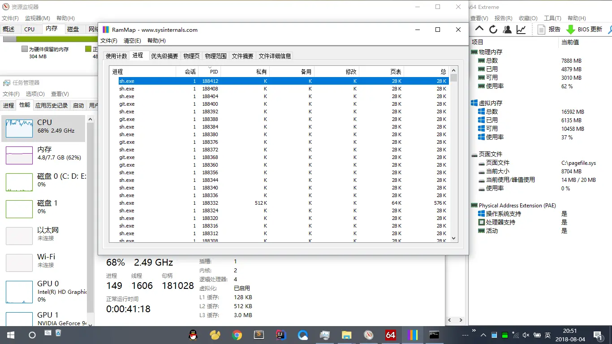

### 前言

---

在上回 [SVN 项目迁移到 Git](https://www.jianshu.com/p/5dcf658851f7) 的过程中遇到了内存泄漏的问题，本文就这个问题做一次分析和记录。

### 第一回合

---

之前对迁移过程做了大量测试，觉得都没问题了，就把项目带回家准备利用周末的时间来迁移，下周其他同事就可以正常提交代码而不用耽误太多时间了。

当然，回家后不会立即开始迁移，先做点正事。迁移的时候电脑应该专心点，免得出现什么未知问题，所以睡觉前开始挂机，醒来估计差不多就好了。嗯，想法很美好。

第二天起来，准备收割胜利的果实，结果发现电脑死机了（ 鼠标虽然还能动，但是点啥都没反应，键盘也毫无响应 ），无奈之下只好按电源强制关机了。

### 第二回合

---

想起来挂机的时候同时开了两个任务（ `git subtree` 和 `git filter-branch` ），会不会是这两个任务冲突了？那就一个一个执行吧，重新开始挂机，出门去。

晚上回来之后，电脑不出意外又死机了。

### 第三回合

---

前两次死机的时候我都不在现场，如果我盯着它，干活应该能认真点？强制关机，再次开启任务，打开任务管理器，我倒要看看是什么原因导致的。

开启任务后 **CPU** 开始飙升，查看进程发现竟然不是 **Git** 而是 **电脑管家的实时防护服务** ，喧宾夺主了吧。想关掉这个服务，试了各种方法都关不掉，最后干脆直接卸载。

卸载完 **电脑管家** 重新开始任务，结果 **CPU** 还是飙升，这回是 **win10** 自带的 **Windows Defender** ，同理禁用掉。（ 后来发现，这两个软件应该是对 **Git** 产生的大量文件进行扫描，虽然会占用一些 **CPU** ，但是并没有太大影响，所以不必禁用 ）

重新开始后 **CPU** 就正常了，接下来就是慢慢等待了。半小时，一小时... 一切还算正常，不过内存占用有点上升。按照任务已完成的进度和增长的内存，粗粗算了一下，发现内存根本坚持不到任务结束的那一刻。果然，几个小时之后，内存就满了，磁盘利用率开始飙升，然而任务还有一大半没完成，而且速度越来越慢，不过电脑还能正常使用。继续等待，一个小时后，不出意外，终于死机了。

### 问题分析

---

通过上面的试验可以确认，死机的原因是 **内存泄漏** 了，但是什么原因导致的 **内存泄漏** 还无法得知。

下面给出本次迁移使用的机器配置

| 机器                    | 系统       | 配置  | 测试结果                         |
| ----------------------- | ---------- | ----- | -------------------------------- |
| 公司的闲置笔记本（ A ） | win10 1703 | i5 8G | 正常执行迁移任务，不存在内存泄漏 |
| 公司的工作笔记本（ B ） | win10 1803 | i5 8G | 内存泄漏                         |
| 家里的笔记本（ C ）     | win10 1709 | i5 8G | 内存泄漏                         |

既然有一台电脑是正常的，那就可以排除操作系统的问题了，对比下闲置电脑和我日常使用的电脑有哪些差异（ 系统配置，安装的第三方软件等等 ）。

1. 首先注意到电脑 A 的虚拟内存配置和其他两台电脑不太一样，那就调成一样或者关掉虚拟内存试试。结果内存还是会泄漏，不过内存用满了之后任务就因为内存不足自动结束了，也就不会死机了。到这一步可得知死机的原因是 **物理内存耗尽后，大量使用磁盘虚拟出来的内存** ，但是还没从根源上找到内存泄漏的原因。

2. 对比任务管理器中的运行的服务，一个个关掉后测试，有点费劲费时（ 这真是个笨方法，后来想到重启进入 **安全模式** 测一遍就好了 ）。忽然注意到，前面提到的 **电脑管家的实时防护服务** 和 **Windows Defender** 会占用较多的 **CPU** ，那么和它们类似的 **扫描类/底层拦截类** 的软件也很有嫌疑。这回把目标瞄准 **ADSafe** 这个广告拦截软件，禁用服务，再次开启迁移任务。等待了一个小时，内存竟然没有增长，看来 **真凶** 就是它了。

### 问题复现

---

先上截图，看下开启 **ADSafe** 时的资源使用情况

---

对比前面两张图看下半小时的数据差异：

1. 资源管理器中 **使用中** 增长了 **2.1G** ， **已提交** 增长了 **2.9G**
2. 资源监视器中 **可用** 的内存几乎都转为 **正在使用**
3. **RAMMap** 中 **进程私有** 增长了 **100M** ， **映射文件** 增长了 **1G** ， **页表** 增长了 **1.2G**

可以发现进程并没有泄露内存， **映射文件** 占用的内存不用太在意，唯一异常的地方在于 **页表** 这一项。

再上一张 **RAMMap** 中进程标签页下的截图：

可以看到大量的进程，其中 **PID** 由最初的 **1W+** 增长到了 **18W+** ，而且这些进程大部分在任务管理器是不存在的（ 即进程已结束 ）。粗粗统计了下，大约有 **46000** 个进程（ `sh.exe/git.exe/cat.exe` ），每个占用 **28K** ，合计大约有 **1.22G** ，正好和上面的 **页表** 内存增长量相吻合，所以应该是这部分内存无法回收利用导致的内存泄漏（ 这估计是系统的 **bug** ，进程结束应该释放页表占用的内存才对 ）。 [类似情况](https://social.technet.microsoft.com/Forums/msonline/en-US/69879cec-902c-424a-b391-4e9d7aea5385/windows2008r2-sp1?forum=WinServerPreviewZHCN#176e3b01-610b-4b54-8faf-efecb4854a39)

关掉 **ADSafe** 后再次试验： `sh.exe/git.exe/cat.exe` 进程数虽然也增加了几十个，但是和前面的 **4W+** 比起来完全不是一个数量级。

### 结论

---

通过上面的测试，可以定位到内存泄漏的根源： **ADSafe** 和 **Git** 有所冲突，导致 **Git** 不断创建新的进程。至于是什么冲突那就无法得知了，和 **ADSafe** 说拜拜就好了。

### 拓展知识

---

#### 文中用到的内存分析工具

- [`RAMMap`](https://learn.microsoft.com/sysinternals/downloads/rammap)
- [`VMMap`](https://learn.microsoft.com/sysinternals/downloads/vmmap)
- [`AIDA64 Extreme`](https://www.aida64.com/products/aida64-extreme)

#### 关于任务管理器中的内存指标

| 类别                | 说明                                                                                                                                                                   |
| ------------------- | ---------------------------------------------------------------------------------------------------------------------------------------------------------------------- |
| **使用中**          | 进程使用的内存大小，内存使用率就是用这个值计算的，实际上这个值并没有太大意义。                                                                                         |
| **已提交 ( 已用 )** | 所有程序真正占用的内存，当这个值接近或者超过物理内存大小的时候，电脑基本已经开始变卡了，因为这时候已经开始使用磁盘所虚拟出来的内存，想想内存和磁盘的读写速度就知道了。 |
| **已提交 ( 总 )**   | 也就是 **虚拟内存** ，等于 **物理内存** + **系统盘下 pagefile.sys 文件的大小**                                                                                         |

关于 **使用中** 和 **已提交** 的区别，我的理解是：一个进程向操作系统申请了 **1G** 的内存，那么这些内存就都归这个进程使用，虽然它现在只使用了 **200M** ，但剩下 **800M+** 应该为这个进程保留，而不能拿去给别的进程使用，这个例子中 **已提交** 就是 **1G** ， **使用中** 是 **200M** ，两者之差可以反映出程序的内存利用率。

- [Windows 8 或者 Windows10 的任务管理器中，内存已提交的两个数字都是什么意思?](https://www.zhihu.com/question/43714216/answer/96359711)
- [Win 7 “已修改”内存占了几 G ，怎么才能让它自动释放？](https://www.zhihu.com/question/19828627/answer/133877436)
- [windows 任务管理器中的工作设置内存,内存专用工作集,提交大小详解](http://shashanzhao.com/archives/832.html)

#### 是否应该禁用虚拟内存（ pagefile.sys ）

个人不建议禁用。比如我平时工作时，开一个 **IDEA** 再把工作项目都启动，基本上 **8G** 的内存都用完了，这时如果我再开个 **Chrome** 就要用到 **虚拟内存** 了，内存再挤一点用一点。但是如果我禁用了 **虚拟内存** ，就会提示 **内存不足** 导致程序崩溃，或者需要关闭 **其他使用中的程序** 腾出内存才能打开新的程序。 **虚拟内存** 的意义在于： **物理内存** 不足的时候使用磁盘来代替内存，虽然会卡一点，但是能满足使用所需（ 就是要开这么多程序 ）。同样的， **内存不足** 这个问题的根本解决办法应该是 **加内存并且少开程序** 而不是一味的加大 **虚拟内存** 。

#### 关于 RAMMap 中的指标

按照我的经验， **剩余可用内存** 基本上等于 **映射文件（ 备用 ）** + **未使用（ 归零 + 可用 ）** 。如果开启了 **Superfetch** 服务，系统会把一些常用的文件读取到内存（ **映射文件** ）中，这样程序中用到这些文件的时候就能更快的读取，这部分内存在 **内存不足** 的时候是可以拿来给其他进程使用。

- [内存查看工具 RAMMAP 说明](https://www.cnblogs.com/tudoux/p/4634888.html)
- [内存详解](http://www.cnblogs.com/georgepei/archive/2012/03/07/2383548.html)

#### 关于页表

对于页表我也不了解，页表应该就是一个目录结构，保存 **内存地址映射关系** ，通过它程序能把内存的 **逻辑地址** 转为 **实际的物理地址** 。

- [怎样通俗的理解操作系统中内存管理分页和分段？](https://www.zhihu.com/question/50796850)
- [内存分页大小对性能的提升原理](https://blog.csdn.net/chluknight/article/details/6689323)
- [操作系统内存管理之 分页与虚存（页表、页框、内存）](http://www.mamicode.com/info-detail-1289630.html)
- [页表到底占用多少空间？一些疑惑和思考](https://blog.csdn.net/iawes/article/details/50915975)

---

#### 转载请注明出处： [https://www.jianshu.com/p/7510e57aeaff](https://www.jianshu.com/p/7510e57aeaff)
