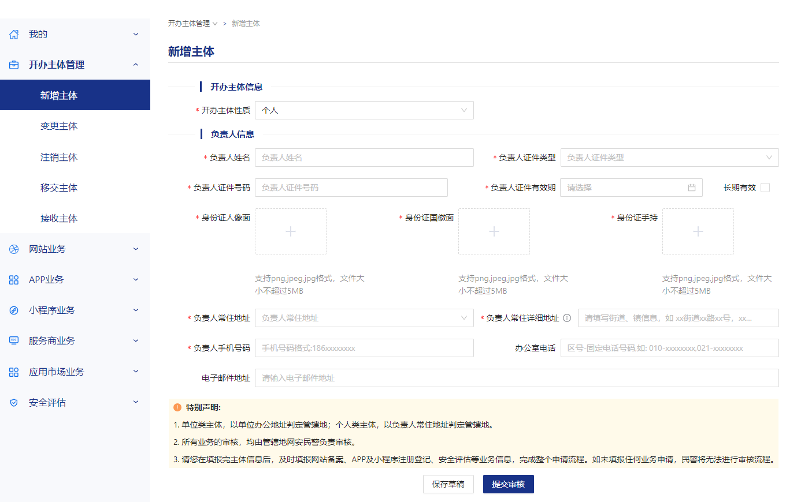

### 前言

---

最近新买了域名并做了备案，记录一下。


### [域名注册](https://help.aliyun.com/zh/dws/user-guide/register-a-domain-name-on-alibaba-cloud)

---

[](https://wanwang.aliyun.com)

👉 [阿里云域名购买流程图（ 新版教程 ）](https://developer.aliyun.com/article/1091892)

#### 域名费用

首年注册的价格都比较便宜的，但是后面续费的价格就不便宜了，所以需要考虑清楚这个域名要用多久。

而且不能光看 **新注价格** ，不同类型域名的 **续费价格** 是不一样的 👉 [价格总览](https://wanwang.aliyun.com/help/price.html)

- 如果只是临时用用就丢弃，可以就买一年，新用户还可以看下是否满足 [一元购](https://wanwang.aliyun.com/newdomain/1yuan) 的条件

  > [!IMPORTANT]
  >
  > **丢弃域名的话还要及时 [注销备案](https://help.aliyun.com/zh/icp-filing/basic-icp-service/user-guide/the-cancellation-of-registration-1) 以避免别人以后用这个域名从事非法活动连累到自己，以后新买域名要重新备案。**

  

- 如果打算长期使用，一次性买 **10** 年也只要 **188**

  

**新购或续费的时候可以先搜一下有没有 [优惠口令](https://help.aliyun.com/zh/dws/support/discount-codes) ，能省一点是一点。**

#### 域名实名

> - [关于进一步加强域名实名核验要求的通知](https://help.aliyun.com/noticelist/articleid/1060990693.html)
> - [关于强制完成域名实名核验要求的通知](https://help.aliyun.com/noticelist/articleid/1061053119.html)

**需要先 [新建域名实名模板](https://help.aliyun.com/zh/dws/user-guide/create-a-domain-name-registrant-profile) ，然后在确认订单页面选择已完成实名核验的信息模板 ，不然无法提交订单。**

- [邮箱验证、信息模板实名认证](https://developer.aliyun.com/article/1091681)
- [域名购买后需要用信息模板对域名再实名认证一遍](https://help.aliyun.com/zh/dws/user-guide/real-name-verification-for-generic-domain-names#section-cti-s5f-beh)
- [【Linux】Centos 8 服务器部署：阿里云域名注册、域名解析、个人网站 ICP 备案详细教程](https://blog.csdn.net/qq_39720249/article/details/134033592)

个人实名认证审核几分钟就好了，成功后会收到短信，提示： **若需使用域名备案，请至少等待 3 天信息同步后再操作** 。

#### 域名注册成功后

我直接就进行 [域名解析](#域名解析) 了，等解析生效后就能通过域名访问到网站，但再过一会儿就被阿里云阻断访问了，因为没备案。


出现这个页面应该是说明实名信息已同步，可以开始备案了。

**注意：在开始 ICP 备案前需要先把域名解析记录暂停或者删掉，否则会影响备案审核。**

#### FAQ

---

- [域名注册年限最高 10 年，然后不能续费了怎么办？](https://www.zhihu.com/question/40761693)
- [域名到期没续费怎么办？](https://www.zhihu.com/question/366711737)

### ICP 备案

---

#### 什么是 ICP 备案

> [政策文件](https://beian.miit.gov.cn/#/Integrated/lawStatute)
>
> 根据 **《互联网信息服务管理办法》** 以及 **《非经营性互联网信息服务备案管理办法》** ，国家对经营性互联网信息服务实行 **许可制度** ，对非经营性互联网信息服务实行 **备案制度** ，未取得许可或者未履行备案手续，不得从事互联网信息服务。即所有对中国内地提供服务的网站或 APP 都必须先进行 ICP 备案，才可开通服务。

#### 是否一定要备案？

> ICP 备案主要看您的网站或 APP 等互联网信息服务解析到的服务器是否在中国内地（ 大陆 ），如果服务器在中国内地（ 大陆 ），必须完成 ICP 备案才可对外提供服务。如果服务器在中国香港、中国澳门、中国台湾及其他国家和地区，则不需要进行工信部 ICP 备案，仅需要完成公安联网备案。查看 [备案的必要性](https://help.aliyun.com/zh/icp-filing/getting-started/the-necessity-of-the-icp-for-the-record-1) 。

#### 不备案有什么影响？

> 阿里云提供的 ICP 备案分为网站备案和 APP 备案：
>
> 如果您未在阿里云完成网站备案，直接将域名解析至阿里云中国内地（ 大陆 ）服务器上，将被阿里云监测系统识别并阻断网站的访问服务，提示您需先完成备案操作。
>
> 如果您未完成 APP 备案，将影响 APP 在移动应用市场的上架发布。

**说白了，用到了国内的服务器且想在国内通过域名提供合法、稳定、快速的网站服务就得去备案。**

#### [ICP 备案流程](https://help.aliyun.com/zh/icp-filing/user-guide/icp-filing-application-overview)

> [!IMPORTANT]
>
> **ICP 备案期间一定要保持电话畅通！**

##### 1. [准备 ICP 备案所需资料](https://help.aliyun.com/zh/icp-filing/required-materials)

- [一个阿里云账号](https://help.aliyun.com/zh/icp-filing/basic-icp-service/user-guide/create-an-alibaba-cloud-account-to-apply-for-an-icp-filing)

- [域名注册及域名实名认证，且有效期大于三个月](https://help.aliyun.com/zh/icp-filing/getting-started/to-prepare-the-icp-record-domain-name-1)

  > [!IMPORTANT]
  >
  > 实名认证完成后需要约三天时间将实名认证信息入库管局。建议您在实名认证完成后至少等待三天，待信息同步后再申请 ICP 备案，否则可能存在管局审核时检查不到最新域名实名认证信息，导致 ICP 备案失败的风险。

  我的实际操作是域名买完第二天就开始备案了。

- [一台用于备案的云服务器](https://help.aliyun.com/zh/icp-filing/getting-started/to-prepare-for-the-record-the-server)

  最近正好阿里云又有活动了（ **99 / 年支持续费 3 次** ），不歧视老用户，配置比乞丐版稍微好一点，个人开发也够用了。

  

- 居民身份证

- 辅助资料（ [各地管局要求不同](https://help.aliyun.com/zh/icp-filing/basic-icp-service/user-guide/icp-filing-regulations-of-the-miit-for-different-regions) ）

  > [!NOTE]
  >
  > 看别人教程还需要下载 [承诺书](https://help.aliyun.com/zh/icp-filing/support/the-internet-for-the-record-information-authenticity-commitment) 签字盖手印的，那就还需要打印机和印泥（ 红笔、口红代替 ）。
  >
  > 目前浙江省不需要额外提供下面这些材料。

  - [域名证书](https://help.aliyun.com/zh/icp-filing/support/the-domain-name-certificate)
  - [手持个人证件照片](https://help.aliyun.com/zh/icp-filing/support/armed-with-personal-id-photo)
  - [网站建设方案书](https://help.aliyun.com/zh/icp-filing/website-construction-proposal)
  - 暂住证或居住证
  - 组网方案建设书

##### 2. 申请 ICP 备案

网上的教程都是在 [阿里云 ICP 代备案管理系统](https://beian.aliyun.com) 的 **PC** 端操作的，步骤大同小异。

- [ICP 备案中 - 操作指导（ PC 端 ） - 阿里云](https://help.aliyun.com/zh/icp-filing/basic-icp-service/user-guide/basic-information-check)
- [【Linux】Centos 8 服务器部署：阿里云域名注册、域名解析、个人网站 ICP 备案详细教程](https://blog.csdn.net/qq_39720249/article/details/134033592)
- [域名备案流程（ 个人备案，腾讯云 / 阿里云 ）](https://blog.csdn.net/qq_62982856/article/details/133307488)

**而我实际操作是在阿里云 APP 上进行的，操作更便捷，需要填写的内容更少，值得推荐。**

- [使用阿里云 APP 进行 ICP 备案引导 - 阿里云](https://help.aliyun.com/zh/icp-filing/user-guide/using-icp-registration-guide-ali-cloud-app)

具体步骤照着 **APP** 的提示走就好了，就讲一下注意事项：

- 准备好身份证实时拍照，证件照片上传后相关信息就填充上了，不用自己再手填。

- **人脸核验时，找一面白色的墙体，光线不能太亮或太暗，注意着装和仪容，毕竟是拍照上传到服务器的。**

  - [上传资料及真实性核验](https://help.aliyun.com/zh/icp-filing/basic-icp-service/user-guide/upload-data-and-authenticity-verification)

    > - 您使用移动端进行首次备案或新增网站（ 原备案不在阿里云 ）等备案申请时，在此步骤仅需上传所需的辅助资料，无需进行真实性核验。
    > - 自 2019 年 7 月 29 日起，根据管局对 ICP 备案真实性的要求，阿里云 ICP 备案流程中使用移动端进行人脸核验保障真实性， **幕布拍照方式不再使用** 。

- **通讯地址** 需要 **详细到门牌号** ， **地区** 就是通讯地址所在的地区，而 **证件地址** 就是身份证上的地址，和前面选的地区不一致没关系。

- **手机号码** 和 **邮箱** 自动填充了阿里云账号关联的信息，可以自己修改下，额外加一个 **应急手机号码** 。

- **网站域名** 一般填 **主域名** 即可。

- **网站名称** 对应的 [要求](https://help.aliyun.com/zh/icp-filing/basic-icp-service/user-guide/fill-in-the-website-information-2) 有点多，烂大街的通俗命名基本不能用了， **建议可以取诗意一点、没有具体含义的短句、歌词，不容易重名的** ，我就是用 **高德地图** 注册时随机生成的昵称简单修改一下的，直接通过。

  

  > [!NOTE]
  >
  > 查网站重名有一个小技巧：因为有 ICP 备案的网站基本都做了公安备案，所以可以去公安备案的系统里根据网站名称进行查询是否存在记录。 👉 [网站备案查询](https://beian.mps.gov.cn/#/query/webSearch)

  - [个人网站备案起名到底怎么起？](https://www.zhihu.com/question/24023706)
  - [大家网站个人 ICP 备案博客类网站名称都写的啥？](https://www.zhihu.com/question/559934659)

- 因为前面的 **网站名称** 太抽象了看不出网站是做什么内容的，需要在 **备注** 里面描述清楚，主要体现 **个人开发和自己学习使用的** ，可以参考下面这段话自己修改一下（ **不要照抄** ）。

  ```
  用于个人网站搭建，写一些随笔笔记，用于学习了解域名知识。了解服务器和网站部署流程。
  ```

  > [!IMPORTANT]
  >
  > **网站名称** 中不能用的 [禁用词](https://help.aliyun.com/zh/icp-filing/basic-icp-service/user-guide/fill-in-the-website-information-2#section-3u2-v69-gw0) 同样也不能出现在 **备注** 里。

- 个人备案中： **网站内容** 固定只能选 **其他** ， **服务类型** 固定只能选 **网站应用服务** 。

- 会自动选择 [云服务和 IP 地址](https://help.aliyun.com/zh/icp-filing/basic-icp-service/user-guide/appendix-choice-of-cloud-services-and-ip-address) ，如果有多个实例则需要手动选择要进行备案的实例。

  

- **未备案成功的域名不能存在解析**

  

  - [刚备案的域名能解析吗？](https://www.zhihu.com/question/640027497)
  - [域名在备案时，可以解析到某个 IP 么？还是必须要清空域名解析？](https://www.zhihu.com/question/20044644)

##### 3. [阿里云初审](https://help.aliyun.com/zh/icp-filing/user-guide/the-icp-record-review)

> 一般 **1** 个工作日左右。

提交申请当天，阿里云工作人员会打电话过来确认网站信息、用途，并告知审核通过、接下来会提交到管局。

**如果初审没通过可以问清楚应该怎么修改。**

##### 4. [工信部短信核验](https://help.aliyun.com/zh/icp-filing/sms-check)

阿里云初审通过几分钟后就会收到工信部发送的核验短信，打开 [工信部备案管理系统](https://beian.miit.gov.cn) 进行 **短信核验** 。


> [!IMPORTANT]
>
> 您需要在收到短信的 24 小时内完成短信核验，短信核验成功后备案申请将进入管局审核。
>
> 若收到核验短信 24 小时内没有进行验证或验证失败， ICP 备案订单将自动退回至您的阿里云账号，详情请参见 [工信部短信核验未通过（ 验证超时或验证失败 ）怎么办？](https://help.aliyun.com/zh/icp-filing/sms-check-the-faq#section-g4n-wrp-dgb) 。

短信核验结果在 **24** 小时后才同步到阿里云，如果不放心可以再核验一遍：


##### 5. 管局审核

> 各省管局审核时间不同，实际审核时长会根据 ICP 备案场景有所不同，一般为 **1~20 个工作日** ，具体以实际审核时间为准。

等了 **3** 天就收到工信部的审核通过短信了，不过短信里的备案号是 **ICP 备案主体** 的（ 如 `浙ICP备123456号` ）而不是网站的，拿这个备案号马上去查是查不到信息的。

> 管局审核通过后，审核信息需要一段时间才能同步到 [阿里云 ICP 代备案管理系统（ 我的 ICP 备案信息 ）](https://beian.aliyun.com/order/index.htm) ，若您备案的为网站，在此期间，您可以设置 **域名解析** 及进行 **网站安全检查** 。

阿里云上备案结果大概 **4** 小时后才同步过来，此时才算真的备案成功了，可以查看网站的实际备案号（ 比如 `浙ICP备123456号-1` ）。

顺带提一下，阿里云有一个 [备多久送多久](https://help.aliyun.com/zh/icp-filing/product-overview/the-icp-record-how-long-how-long-does-it-take-to-send-it-to-participate-in-the-rules) 的活动，备案成功后会收到 **ECS** （ 用于备案的这台主机 ）续费的短信，就是整个 ICP 备案审核过程用了几天时间就给 **ECS** 延期几天（ 不超过 **30** 天 ）。

##### 6. [ICP 备案后处理](https://help.aliyun.com/zh/icp-filing/user-guide/the-icp-record-post-processing-1)

- [在网站底部添加 ICP 备案号](https://help.aliyun.com/zh/icp-filing/support/website-to-add-the-record-number-faq)

  > ICP 备案成功后，您需要在 ICP 备案成功的网站底部悬挂工信部下发的 ICP 备案号，并生成链接指向工信部网站：beian.miit.gov.cn 。 **如果未添加 ICP 备案号，被相关部门核查出来将处以五千元以上一万元以下罚款。**

  通用代码：

  ```html
  <a href="https://beian.miit.gov.cn/" target="_blank">您的备案号</a>
  ```

  可以多去别人网站看下怎么放置的，点击链接根据备案号可以查询到网站信息。

- 添加版权所有

  > ICP 备案成功后，部分省份管局要求，例如江苏省，需要在网站下方添加版权所有，所添加的版权所有需要与您的单位名称保持一致。

- （ 可选 ）经营性备案

  这个是需要公司资质的，个人备案用不上。

  - [ICP 是什么， ICP 备案和 ICP 经营许可证有什么区别？](https://www.zhihu.com/question/590686638)
  - [ICP 许可证和增值电信业务经营许可证的区别？](https://www.zhihu.com/question/268818619)

- [公安联网备案](#公安备案)

#### FAQ

---

- [备案指引 - 阿里云 ICP 代备案管理系统](https://beian.aliyun.com)
- [不同场景下的 ICP 备案说明 FAQ](https://help.aliyun.com/zh/icp-filing/faq-about-icp-filing-applications-in-different-scenarios)
- [通过 IP 访问的网站进行 ICP 备案](https://help.aliyun.com/zh/icp-filing/basic-icp-service/product-overview/icp-filing-requirements-for-a-regular-website#section-hr2-5cj-veg)
- [论坛网站进行 ICP 备案](https://help.aliyun.com/zh/icp-filing/basic-icp-service/product-overview/icp-filing-requirements-for-a-regular-website#section-vvy-37h-ezn)
- [ICP 备案相关的一些基本概念和术语](https://help.aliyun.com/zh/icp-filing/terms)
- [ICP 备案进度查询](https://help.aliyun.com/zh/icp-filing/getting-started/the-progress-of-inquires-1)
- [备案驳回 FAQ](https://help.aliyun.com/zh/icp-filing/support/for-the-record-to-dismiss-the-faq)
- [删除域名或网站的备案信息 FAQ](https://help.aliyun.com/zh/icp-filing/support/to-delete-a-domain-name-or-web-site-registration-information-faq)
- [请问主域名备案了，子域名还要备案吗？](https://developer.aliyun.com/ask/524435)
- [以个人名义在阿里云搭建企业的内部网站，需要备案吗？](https://www.zhihu.com/question/354786342)

### [域名解析](https://help.aliyun.com/document_detail/29716.html)

---

- 登录 [阿里云域名控制台](https://netcn.console.aliyun.com/core/domain/list)
- 在 **域名列表** 中定位目标域名，单击 **操作** 列下的 **解析** ，进入解析设置页面
- 在 **解析设置** 页面，单击 **新手引导**
- 勾选网站域名
  - [x] `test.com` （ 对应设置 `@` 主机记录 ）
  - [x] `www.test.com` （ 对应设置 `www` 主机记录 ）
- 输入网站的 **IP**
- 等待几分钟后，使用域名访问网站以验证（ **A 记录** ）是否生效

### 网站搭建

---

后面公安备案可能需要审查内容（ **比如区分是否交互式** ），网站有内容了也方便审核的时候给出整改意见，所以提交 ICP 备案申请之后就可以开始着手准备网站的内容了，审核通过后可以快速上线。

网站放什么内容因人而异，但考虑到有人和我一样主域名只用来备案，子域名用来接口开发或其他用途的，就顺便说一下：

- 从备案流程上看，网站未开发完成（ 无内容 ）也是能通过备案的
  - [网站还没有搭建好能备案吗？](https://www.zhihu.com/question/606896746)
- 网站内容要有实际意义，但有的网站主域名全空白只有一行话也照样运行

在 ICP 备案之前我就已经装好 **Nginx** 了，通过 **IP** 能直接访问 **Nginx** 的默认首页，不过我也不知道是这个默认首页已经符合备案要求了还是之前就没审核过这个页面。为了以防万一，还是自己改个页面填充一下内容：

- **一定要将网页标题设置为备案时填写的网站名称**

- **一定要将备案信息放置在网页底部**

- ~~调用 [一言 API](https://hitokoto.cn) 动态生成内容~~

  **外部接口还是不受控制** ，最好还是提取部分数据后自己做静态展示。

- 稍微调整下背景和字体颜色样式，使页面不至于太过苍白

交互型网站放实际的内容就好了，个人非交互型网站一般只能是个人博客、作品展示这类网站了，稍微有点内容应该都符合备案时填写的描述。

我的网站按上面的步骤只展示一句话已经通过公安备案了，至于是否符合工信部的不定期抽查还需要时间去验证。

- [大家个人备案的网站都放点啥？](https://s.v2ex.com/t/983231)
- [个人备案的域名能做哪些内容？](https://www.zhihu.com/question/318666086)

> [!NOTE]
>
> 阿里云上有 [备案信息风险诊断工具](https://help.aliyun.com/zh/icp-filing/user-guide/for-the-record-information-risk-diagnostic-tool) ，不过得备案成功一个月后才能用。

### 公安备案

---

#### 什么是公安备案

> 公安局备案又叫网安备案。公安备案的目的就是为了防止在网上从事非法的网站经营活动，打击不良互联网信息的传播，营造一个良好的互联网环境。
>
> **[阿里云文档](https://help.aliyun.com/zh/icp-filing/user-guide/the-public-security-network-for-record-and-cancellation)** 👇
>
> 依据 **《计算机信息网络国际联网安全保护管理办法》** 相关规定，各网站在工信部进行 ICP 备案成功后，或网站部署在非中国内地的服务器上但是为中国内地提供服务，则需在网站开通之日起 30 日内登录 [全国互联网安全管理服务平台](https://beian.mps.gov.cn) 提交公安联网备案申请。

**相关法律条文：**

> **《计算机信息网络国际联网安全保护管理办法》（ 公安部令第 33 号 ）** 👉 [查看全文](https://flk.npc.gov.cn/detail2.html?ZmY4MDgwODE2ZjNjYmIzYzAxNmY0MGRkYTNkZDA4MmY)
>
> - **第十一条**
>
>   用户在接入单位办理入网手续时，应当填写用户备案表。备案表由公安部监制。
>
> - **第十二条**
>
>   互联单位、接入单位、使用计算机信息网络国际联网的法人和其他组织 ( 包括跨省、自治区、直辖市联网的单位和所属的分支机构 ) ，应当自网络正式联通之日起 30 日内，到所在地的省、自治区、直辖市人民政府公安机关指定的受理机关办理备案手续。
>
>   前款所列单位应当负责将接入本网络的接入单位和用户情况报当地公安机关备案，并及时报告本网络中接入单位和用户的变更情况。
>
> - **第十四条**
>
>   涉及国家事务、经济建设、国防建设、尖端科学技术等重要领域的单位办理备案手续时，应当出具其行政主管部门的审批证明。
>
>   前款所列单位的计算机信息网络与国际联网，应当采取相应的安全保护措施。

#### 不履行备案职责的法律后果

> - **第二十三条**
>
>   **违反本办法第十一条、第十二条规定，不履行备案职责的，由公安机关给予警告或者停机整顿不超过 6 个月的处罚。**

**简单说就是正规合法的网站一定要去公安备案，逃不掉的，早备案更省事。**

#### 公安备案所需资料（ 个人 ）

- 身份证正反面照片
- [身份证手持照片](https://help.aliyun.com/zh/icp-filing/support/armed-with-personal-id-photo)
- [域名证书（ 图片 ）](https://help.aliyun.com/zh/icp-filing/support/the-domain-name-certificate)

#### 公安备案步骤

- 进入 [全国互联网安全管理服务平台](https://beian.mps.gov.cn) ，单击 **用户登录**

- 跳转到 **公安部“互联网+政务服务”平台** 页面进行登录

  新用户需要注册一个账号，同时下载 **公安一网通办 APP** ，每次登录都要用这个 **APP** 进行实人认证的。

  登录后自动跳转回 **全国互联网安全管理服务平台** 。

- 新注册的账号是没有主体的，点击 **申请主体** 进行新增

  

  **开办主体性质** 选择 **个人** ，其他信息正常填写即可，单击 **提交审核** 。常住地址可以不写门牌号，到时候由所在区的 **网安大队** 审核。

  

  我是中午 **13** 点申请的， **14** 点网警上班后打电话过来，主要是确认本人是否在当地工作生活以及网站的用途、性质（ **不能办论坛** ），然后 **18** 点收到短信 **新增主体审核通过** 。

  > [!NOTE]
  >
  > 打电话过来的时候可以顺便问一下有哪些注意事项以及自己疑惑的地方。

- 点击左侧菜单 **网站业务 - 新办网站申请**

  **不需要等待新增主体审核通过，可以继续进行新办网站申请**

  

  - **网站信息** 从 [ICP 备案信息](https://beian.aliyun.com/order/index.htm) 那里复制过来就好了

  - **网站开通日期** 可以选择 **当日**

  - **域名证书** 从 [阿里云域名控制台](https://netcn.console.aliyun.com/core/domain/list) 下载（ [如何获取域名证书](https://help.aliyun.com/zh/icp-filing/support/the-domain-name-certificate) ）

    > 域名证书确定了域名注册者对域名的拥有权以及拥有期限。

    一开始我把 **域名证书** 理解成了 **SSL 证书** ，难道要强制 **HTTPS** 吗？后来一想应该就是域名的购买凭证吧。

  - **服务商信息** 直接点击蓝色按钮 **查询网络 xxx 服务商** ，搜索 **阿里云** 选择即可

    手填的话，需要的信息从这里找 👉 [公安联网备案信息填写指南](https://help.aliyun.com/zh/icp-filing/user-guide/the-public-security-network-for-the-record-information-fill-in-the-guide)

    

  - 一般个人网站的话，下面这三个选项都选择 **否** 就行了（ **前提是网站内容符合条件** ）。

    - [ ] **是否提供互联网交互服务**
    - [ ] **是否提供涉及管制物品信息发布服务**
    - [ ] **[相关前置许可](https://help.aliyun.com/zh/icp-filing/pre-approvals)**

    > [!IMPORTANT]
    >
    > **只有** 纯展示、只能浏览的网站属于 **非交互式网站** ，其他的 **包括但不限于** 能登录注册、评论，能让用户 **发表言论和图片** 的都属于 **交互式网站** 。
    >
    > 非交互式网站初步审核完成后即完成公安备案，交互式网站需要进行面审或实地检查（ **去当地网安部门当面审核** ）。

  - **网站安全负责人信息** 和 **网站应急联络人**

    如果都是自己的话，勾选 **同主体负责人信息** ，只要重新上传一下照片。

  等了一个工作日，网安大队再次打电话过来和我确认网站内容后面会不会变动。因为我的网站主要内容就一句话，询问我后面会不会再增加注册、评论这些功能，我也表示基本不会变动了，仅作展示用，后面就没问题了。再等几个小时就会收到审核通过的短信了。

  **再强调一下，现在已经不允许开办论坛网站了。主域名网站内容符合备案条件就可以了，求稳还是尽量不要去改动了。**

- **将公安联网备案信息放置在网页底部**

  > 公安联网备案审核通过后，您需在 30 日内登录 [全国互联网安全管理服务平台](https://beian.mps.gov.cn) ，在您的 **已备案网站** 详情中，复制 **网站公安机关备案号** 和 **备案编号 HTML 代码** ，下载 **备案编号图标** ，并编辑您的网页源代码将公安联网备案信息放置在网页底部。

网上都说公安备案比 **ICP 备案** 要简单，但实操起来要麻烦一点。

#### 参考资料

---

- [网站 ICP 备案之后，公安备案的详细操作流程（ 亲身经历 ）](https://www.seoshipin.cn/seojiqiao/2572.html)
- [公安联网备案及注销](https://help.aliyun.com/zh/icp-filing/user-guide/the-public-security-network-for-record-and-cancellation)
- [网安小课堂丨手把手教你网站“公安备案”](https://mp.weixin.qq.com/s/15YdeBz3OV3xevMtT-q9bg)

### 申请 SSL 证书

---

> **每个阿里云个人或企业用户（ 以实名认证为准 ）每个自然年可以一次性申请 20 张免费证书（ 每个自然年仅限领取 1 次 ）**
>
> - [阿里云免费 SSL 证书申请教程（ 2022 更新 ）](https://www.ssldaquan.com/aliyun/mianfeissl2022)

**2024** 年了，网站实现 **HTTPS** 应该是常规操作了，正好阿里云上有免费的证书可以用。

#### [申请免费 DV 单域名试用证书](https://help.aliyun.com/zh/ssl-certificate/user-guide/apply-for-a-single-domain-dv-certificate-for-free-trial)

##### 1. [领取免费证书额度](https://common-buy.aliyun.com/?commodityCode=cas_dv_public_cn&request={%22product%22%3A%22free_product%22})

[](https://common-buy.aliyun.com/?commodityCode=cas_dv_public_cn&request={%22product%22%3A%22free_product%22})

##### 2. 提交免费证书申请

- 登录 [数字证书管理服务控制台](https://yundunnext.console.aliyun.com/?p=cas)
- 在左侧导航栏，单击 **SSL 证书**
- 在 **SSL 证书** 页面，单击 **免费证书** 页签
- 在 **免费证书** 页签，单击 **创建证书**
- 在 **证书申请** 面板，配置证书参数，选中 **快捷签发** ，单击 **提交审核**

就是先申请免费额度，每次申请证书的时候就从这个额度里面扣。

#### FAQ

---

##### 1. 证书有效期

> [关于免费证书服务策略调整通知](https://help.aliyun.com/zh/ssl-certificate/product-overview/notice-on-adjustment-of-service-policies-for-free-certificates)

免费证书以前是 **一年有效期** 的，现在只有 **三个月有效期** ，相当于变相涨价了（ 只够 **5** 个域名用一年 ），而且需要频繁去续期（ [到期前重新申请一个](https://help.aliyun.com/zh/ssl-certificate/user-guide/solution-of-the-issue-that-a-free-certificate-is-about-to-expire#section-ttj-8s1-y0j) ）。域名不多够用的话也不用在意，毕竟是免费的。

当然其他云服务商同样也有免费的可以用，比如 [腾讯云](https://cloud.tencent.com/document/product/400/6814) 最多支持 **20+30** 个免费证书，而且证书有效期是 **一年** 的。

##### 2. 域名类型

**不支持泛域名绑定（ 例如 \*.test.com ）**

每个子域名需要申请单独的证书，主域名的证书同时支持给 **www** 子域名使用。

##### 3. [域名所有权验证](https://help.aliyun.com/zh/ssl-certificate/user-guide/verify-the-ownership-of-a-domain-name)

因为域名是阿里云上做的 **域名解析** ，直接锁定了 [自动 DNS 验证](https://help.aliyun.com/zh/ssl-certificate/user-guide/verify-the-ownership-of-a-domain-name#section-ulk-hit-czi) ，结果等了半天证书都没签发下来。

发现是没有按预期想的 **自动添加域名验证信息** ，需要自己按照提示内容进行 [手工 DNS 验证](https://help.aliyun.com/zh/ssl-certificate/user-guide/verify-the-ownership-of-a-domain-name#p-xyg-fi3-738) 。去 [云解析 DNS 控制台](https://dns.console.aliyun.com) 对应的域名中添加一条 **TXT** 的解析记录，用于验证域名所有权。等待一会儿记录生效后就能签发证书了。


> [!IMPORTANT]
>
> **在证书签发之前，请勿删除已添加的域名解析记录，否则会导致证书签发失败。**

了解了之后，再申请子域名证书就很快了，几分钟一个。

##### 4. [证书下载和部署](https://help.aliyun.com/zh/ssl-certificate/user-guide/installation-overview)

根据 **服务器类型** 自行下载指定格式的证书即可， **Nginx** 配置可参考下面的教程：

- [Nginx 配置 HTTP 跳转到 HTTPS](https://www.cnblogs.com/zhaoyingjie/p/16597901.html)

  示例完整配置：

  ```nginx
  # HTTP 配置
  server {
      listen 80;

      # 填写绑定证书的域名
      server_name www.xxx.com xxx.com;

      # 强制将 HTTP 的 URL 重写成 HTTPS
      rewrite ^(.*) https://www.xxx.com$1 permanent;
  }

  # HTTPS 使用 SSL 访问的配置
  server {
      # SSL 使用 443 端口
      listen 443 ssl;

      # SSL 证书绑定的单域名
      server_name www.xxx.com xxx.com;

      # 证书 pem 文件
      ssl_certificate cert/www.xxx.com/cert.pem;

      # 证书 key 文件
      ssl_certificate_key cert/www.xxx.com/cert.key;

      # 缓存 SSL 握手产生的参数和加密密钥的时长
      ssl_session_timeout 5m;

      # 使用的加密套件的类型
      ssl_ciphers ECDHE-RSA-AES128-GCM-SHA256:ECDHE:ECDH:AES:HIGH:!NULL:!aNULL:!MD5:!ADH:!RC4;

      # 表示使用的 TLS 协议的类型
      ssl_protocols TLSv1 TLSv1.1 TLSv1.2;

      # 加密套件优先选择服务器的加密套件
      ssl_prefer_server_ciphers on;

      # 应用配置
      location / {
         root /var/www/www.xxx.com; # 网站根目录
         index index.html index.htm;
      }

      # 强制将 URL 重写到 www 子域名
      if ($host != 'www.xxx.com') {
         rewrite ^(.*) https://www.xxx.com$1 permanent;
      }
  }
  ```

  将 `xxx.com` 替换成自己的主域名即可。

- [Nginx 域名跳转配置](https://blog.51cto.com/wgkgood/507179)

### 最后

---

在此之前，我对备案的印象一直停留在 [幕布拍照](https://help.aliyun.com/zh/icp-filing/the-curtain-pictures-check) 、 [邮寄资料](https://help.aliyun.com/zh/icp-filing/basic-icp-service/user-guide/mailing-information) 这些麻烦的事上，没想到现在足不出户几天就能完成备案了。 👍

**备案之后需要更加注意服务器的安全问题，定期检查，避免被人攻击后做一些违法活动。**

> 新服务器才开了几天，看 **Nginx** 日志发现每天都有一堆 **IP** 在扫漏洞，也是挺无语的。

---

#### 转载请注明出处： [https://github.com/anyesu/blog/issues/49](https://anyesu.github.io/blog/articles/49)
